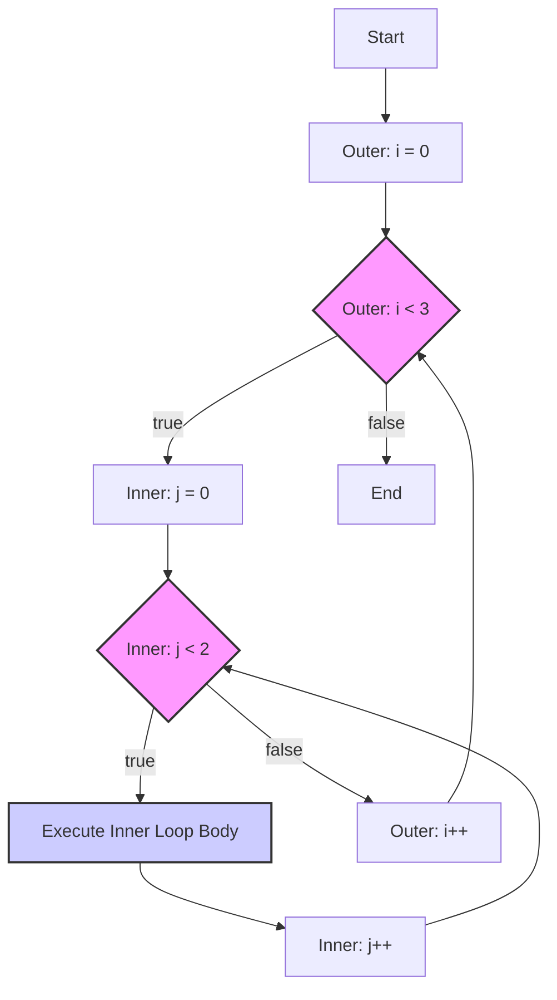

<!--
author:   Sayan Goswami
email:	sgoswami@smcm.edu
version:  0.1.0
language: en
narrator: US English Female

comment: Loops and Arrays

import: https://raw.githubusercontent.com/liaScript/mermaid_template/master/README.md

link: https://fonts.googleapis.com/css2?family=Atkinson+Hyperlegible+Next:ital,wght@0,200..800;1,200..800&family=Atkinson+Hyperlegible:ital,wght@0,400;0,700;1,400;1,700&display=swap

link: https://fonts.googleapis.com/css2?family=Atkinson+Hyperlegible+Mono:ital,wght@0,200..800;1,200..800&family=Atkinson+Hyperlegible:ital,wght@0,400;0,700;1,400;1,700&display=swap

link: https://cdn.jsdelivr.net/gh/sayangoswami/Teaching@main/LiaCourses/theme.css

import: https://raw.githubusercontent.com/LiaScript/CodeRunner/master/README.md

-->


# Refresher: Loops and Arrays


## The `while` statement

```java
public class Main {
    public static void main(String[] args) {
        int n = 10;
        while (n > 0) {
            System.out.println(n);
            n = n - 1;
        }
        System.out.println("Blastoff!");
    }
}
```
@LIA.java(Main)

- Almost reads like English!
- The expression in parentheses is called the *condition*. 
- The statements in braces are called the *body*. 


### How it works

- The flow of execution for a `while` statement is:
	1. Evaluate the condition, yielding `true` or `false`.
	2. If the condition is `false`, skip the body and go to the next statement.
	3. If the condition is `true`, execute the body and go back to step 1.
-  The body of the loop should change the value of one or more variables so that, eventually, the condition becomes `false` and the loop *terminates*. 
- Otherwise the loop will repeat forever, which is called an **infinite loop**.


## Be the computer

What will the following program print:

```java
public class Main {
    public static void main(String[] args) {
        int n = 3;
        while (n != 1) { 
            System.out.println(n); 
            if (n % 2 == 0) { 
                n = n / 2; 
            } else { 
                n = n * 3 + 1; 
            } 
        } 
    }
}
```
@LIA.java(Main)

## The `for` loop

```java
public class Main {
    public static void main(String[] args) {
        int n = 10;
        for (int i = 1; i <= n; i = i + 1) { 
            System.out.println(i);
        }
    }
}
```
@LIA.java(Main)

`for` loops have three components in parentheses, separated by semicolons: the *initializer*, the *condition*, and the *update*.

1. The _initializer_ runs once at the very beginning of the loop.
2. The _condition_ is checked each time through the loop. If it is `false`, the loop ends. Otherwise, the body of the loop is executed (again).
3. At the end of each iteration, the _update_ runs, and we go back to step 2.


## Scope of initialized variable in for loop


```java
public class Main {
    public static void main(String[] args) {
        int n = 10;
        for (int i = 0; i < n; i = i + 1) { 
            System.out.println(i);
        }
        System.out.println(i);  // error. i is not defined
    }
}
```
@LIA.java(Main)

If you declare a variable in the initializer, it *only exists inside* the `for` loop.


### Correct version

```java
public class Main {
    public static void main(String[] args) {
        int n = 10;
        int i;
        for (i = 0; i < n; i = i + 1) { 
            System.out.println(i);
        }
        System.out.println(i);  // this is ok
    }
}
```
@LIA.java(Main)


## The `do`-`while` loop

The `while` and `for` statements are *pretest* loops; they test the condition first and at the beginning of each pass through the loop.

The `do`-`while` is a *posttest* loop. Its useful when you need to run the body of the loop at least once.

```java
import java.util.Scanner;
public class Main {
    public static void main(String[] args) {
        boolean more = true;  
        Scanner input = new Scanner(System.in);  
        do  {  
            // some business logic, such as add a transaction  
            System.out.println("Added transaction. Do you want to add another one.");  
            char ch = input.nextLine().charAt(0);  
            if (ch == 'N' || ch == 'n') more = false;  
        } while (more);
    }
}
```
@LIA.java(Main)


## The `break` statement

When a program reaches a `break` statement, it exits the current loop.

```java
import java.util.Scanner;
public class Main {
    public static void main(String[] args) {
        Scanner input = new Scanner(System.in);  
        while (true) {  
            System.out.println("Enter amount: ");  
            double amount = input.nextDouble();  
            if (amount < 0) {  
                System.out.println("Come back when you are serious.");  
                break;  
            }  
            System.out.println("Enter description: ");  
            String desc = input.next();  
            System.out.printf("Processing $%.2f for %s", amount, desc); 
        }
    }
}
```
@LIA.java(Main)


## The `continue` statement

A `continue` statement skips everything below it and moves on to the next iteration.

```java
import java.util.Scanner;
public class Main {
    public static void main(String[] args) {
        Scanner in = new Scanner(System.in);  
        int x = -1;  
        int sum = 0;  
        while (x != 0) {  
            x = in.nextInt();  
            if (x <= 0) {  
                continue;  
            }  
            System.out.println("Adding " + x);  
            sum += x;  
        }
    }
}
```
@LIA.java(Main)

## Nested Loops

So far, we've used single loops. A **nested loop** is a loop that exists _inside_ the body of another loop.

This is the key to working with 2D data, like grids, tables, and images.

The Concept:

For every one time the outer loop runs, the inner loop runs to full completion.


```java
for (int i = 0; i < 3; i++) {
    // This code runs 3 times (i=0, i=1, i=2)
    
    for (int j = 0; j < 2; j++) {
        // This code runs 3 * 2 = 6 times!
        // (i=0, j=0), (i=0, j=1)
        // (i=1, j=0), (i=1, j=1)
        // (i=2, j=0), (i=2, j=1)
    }
}
```

## The Clock Analogy

The most famous analogy for a nested loop is a **clock**.

- The **Outer Loop** is the **Hour Hand**.
    
- The **Inner Loop** is the **Minute Hand**.
    

The outer loop (hour hand) ticks once.

Then, the inner loop (minute hand) must complete its entire cycle (all 60 minutes).

...before the outer loop ticks again.





## Nested Loop Example: The Grid

The "Hello, World!" of nested loops is printing a grid. The outer loop controls the **rows**, and the inner loop controls the **columns**.


```java
public class Main {
    public static void main(String[] args) {
        // We want 3 rows and 4 columns
        int rows = 3;
        int cols = 4;

        for (int i = 0; i < rows; i++) {
            // This loop body runs 3 times (once per row)
            
            for (int j = 0; j < cols; j++) {
                // This loop prints one row
                System.out.print("* ");
            }
            
            // At the end of a row, print a newline
            // to move to the next one!
            System.out.println();
        }
    }
}
```
@LIA.java(Main)


## Tracing the Grid

Let's trace the execution. `i` is the row, `j` is the column.

<!-- data-type="none" data-sortable="false" -->
|i|j|Output|
|---|---|---|
|0|0|`*`|
||1|`*`|
||2|`*`|
||3|`*`|
||(loop ends)|(prints newline)|
|1|0|`*`|
||1|`*`|
||2|`*`|
||3|`*`|
||(loop ends)|(prints newline)|
|2|0|`*`|
||1|`*`|
||2|`*`|
||3|`*`|
||(loop ends)|(prints newline)|


## Nested Loop Example: The Triangle

A common pattern is when the **inner loop's condition** depends on the **outer loop's variable**.

Let's print a triangle. The number of stars in each row `j` depends on which row `i` we are on.


```java
public class Main {
    public static void main(String[] args) {
        int size = 5;

        // Outer loop: controls the row number (1, 2, 3, 4, 5)
        for (int i = 1; i <= size; i++) {
            
            // Inner loop: prints 'i' stars
            // Row 1 (i=1): prints 1 star (j=1)
            // Row 2 (i=2): prints 2 stars (j=1, j=2)
            // ...
            for (int j = 1; j <= i; j++) {
                System.out.print("*");
            }
            System.out.println();
        }
    }
}
```
@LIA.java(Main)


# Arrays


## The problem with variables

+  Variables can only store one value at a time.
+  What if we wanted to store many values at once
	+  declare many variables


### Example

Say, we have 25 students in a class, and we want to store all their scores.

```java
// declare 25 variables
int score0, score1, score2, score3, score4;
int score5, score6, score7, score8, score9;
int score10, score11, score12, score13, score14;
int score15, score16, score17, score18, score19;
int score20, score21, score22, score23, score24; 

// take 25 inputs from the user
Scanner in = new Scanner(System.in);  
score0 = in.nextInt();  
score1 = in.nextInt();  
score2 = in.nextInt();  
score3 = in.nextInt();  
score4 = in.nextInt();  
score5 = in.nextInt();  
score6 = in.nextInt();  
score7 = in.nextInt();  
score8 = in.nextInt();  
score9 = in.nextInt();  
score10 = in.nextInt();  
score11 = in.nextInt();  
score12 = in.nextInt();  
score13 = in.nextInt();  
score14 = in.nextInt();  
score15 = in.nextInt();  
score16 = in.nextInt();  
score17 = in.nextInt();  
score18 = in.nextInt();  
score19 = in.nextInt();  
score20 = in.nextInt();  
score21 = in.nextInt();  
score22 = in.nextInt();  
score23 = in.nextInt();  
score24 = in.nextInt();
```


What if we wanted to store the scores of **all students in the college**?


### The problem with variables (contd.)

What if we don't even know the number of students in advance?

```java
Scanner input = new Scanner(System.in);  
System.out.println("Enter the number of students: ");  
int n = input.nextInt();  
// how do we store n values now??
```


**Answer**: Use Arrays


## Array

+ A *data structure* is a collection of data organized so that you can perform operations on it *efficiently*.
+ An *array* is a type of data structure that can *hold multiple values under one common name*. 
+ Each value in an array assigned a unique number known as an *index*, which *starts from 0*.
+ A value can be *accessed* using the array name and index
+ Arrays are *mutable* (changeable), which means that once an array is created, the values of its elements can be changed.
+ Arrays must have a specified *type* and *size* (number of items that it stores).


## How to create an array

The syntax to declare an array is
```java
type[] name;
```

The syntax to actually create an empty array is
```java
name = new type[]
```

Example:
```java
int[] scores;
scores = new int[25];
```

+ What is the type of the elements in the array?
+ How many elements can this array store?


### Creating an array in one statement

Just like variables, the declaration and assignment can be done in the same statement.

```java
int[] scores = new int[25];
```


### Another example


```java
Scanner input = new Scanner(System.in);  
System.out.println("Enter the number of students: ");  
int n = input.nextInt();  
int[] scores = new int[25];
```

+ How many elements can this array store?
+ We can store any number of items, even though we don't know how many, in advance.


## How to access an array location (index)

The syntax to access an array element is
```java
name[index]
```

Example

```java
int[] scores = new int[25];
scores[0]; // this is the first grade
scores[24]; // this is the last grade
// scores[25] will throw an error
// scores[-1] will also throw an error
```

The array location `scores[0]` is equivalent to variable `score0` in the motivating example.


## How to modify an array element

The syntax to modify an array element is
```java
name[index] = value;
```

Example

```java
int[] scores = new int[25];
Scanner in = new Scanner(System.in);  
scores[0] = in.nextInt(); // get the first grade
scores[24] = in.nextInt(); // get the last grade
```

Again, `scores[0]` can be modified just like `score0` in the motivating example.


## The array index can be a variable

```java
int[] scores = new int[25];
Scanner in = new Scanner(System.in);
int i = 0;
scores[i] = in.nextInt(); // get the first grade
```


## The array index can also be an expression

```java
int[] scores = new int[25];
Scanner in = new Scanner(System.in);
int i = 0;
scores[i+0] = in.nextInt(); // get the first grade
scores[i+1] = in.nextInt(); // get the second grade
scores[i+2] = in.nextInt(); // get the third grade
// ...
scores[i+24] = in.nextInt(); // get the last (25th) grade
```


## Storing the scores using an Array

```java
import java.util.Scanner;
public class Main {
    public static void main(String[] args) {
        int[] scores = new int[25];  
        Scanner input = new Scanner(System.in);

        // input scores  
        for (int i = 0; i < 25; i++) {  
            scores[i] = input.nextInt();  
        }  
        
        // print all the scores  
        for (int i = 0; i < 25; i++) {  
            System.out.println(scores[i]);  
        }
    }
}
```
@LIA.java(Main)


## Initializing an array with values

Syntax:
```java
type[] array_name = { value0, value1, value2, … , valueM };
```

Example:
```java
int[] arr = {5, 10, 15, 20, 25};
for (int i = 0; i < 5; i++)
	System.out.println(arr[i]);
```


