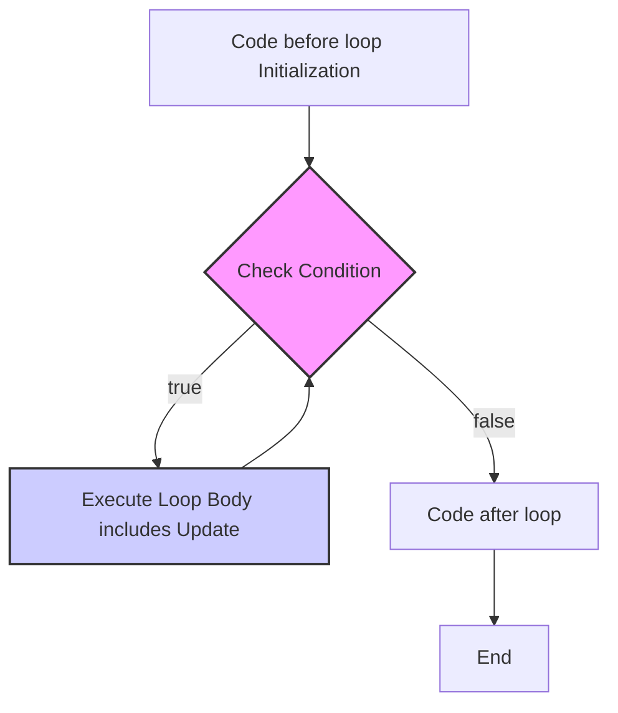

<!--
author:   Sayan Goswami
email:    sgoswami@smcm.edu
version:  0.1.0
language: en
narrator: US English Female

comment:  While loops

import: https://raw.githubusercontent.com/liaScript/mermaid_template/master/README.md

link: https://fonts.googleapis.com/css2?family=Fira+Sans:ital,wght@0,100;0,200;0,300;0,400;0,500;0,600;0,700;0,800;0,900;1,100;1,200;1,300;1,400;1,500;1,600;1,700;1,800;1,900&display=swap

link: https://fonts.googleapis.com/css2?family=Fira+Code:wght@300..700&family=Fira+Sans:ital,wght@0,100;0,200;0,300;0,400;0,500;0,600;0,700;0,800;0,900;1,100;1,200;1,300;1,400;1,500;1,600;1,700;1,800;1,900&display=swap

link: https://cdn.jsdelivr.net/gh/sayangoswami/Teaching@main/LiaCourses/theme.css

import: https://raw.githubusercontent.com/LiaScript/CodeRunner/master/README.md

-->

# Controlling Program Flow - The `while` Loop


---

## The Problem of Repetition

So far, our programs run from top to bottom. Methods let us _organize_ code, and `if` statements let us _choose_ code.

But what if we want to do the same thing 10 times? Or 100 times?

**The "Bad" Way:**

```java
// What if I want to print "Hello!" 5 times?
public class Main {
    public static void main(String[] args) {
        System.out.println("Hello!");
        System.out.println("Hello!");
        System.out.println("Hello!");
        System.out.println("Hello!");
        System.out.println("Hello!");
    }
}
```
@LIA.java(Main)


- This is tedious.
    
- It's impossible if you want to do it 1,000,000 times.
    
- It's not flexible. What if you want to stop early?
    

We need a way to **repeat** a block of code.

---

## Our New Tool: The `while` Loop

You know `if` statements:

> "If this condition is true, run this code **once**."

A `while` loop is very similar. It's like a **repeating `if` statement**:

> "**While** this condition is true, **keep running** this code."

It's our first **loop** structure, a way to control the _flow of execution_ by repeating a section of code.

---

## Anatomy of a `while` Loop

Here is the "boilerplate" syntax. Notice the three key parts.


```java
public class Main {
    public static void main(String[] args) {

        // 1. INITIALIZATION
        // We set up our loop control variable(s) *before* the loop.
        int loopControlVariable = 0;

        // 2. CONDITION
        // The loop begins and checks the boolean condition.
        while (loopControlVariable < 10) {
            // This is the "loop body"
            // As long as the condition is true,
            // the code in this block will run.
            
            System.out.println("Running...");

            // 3. UPDATE
            // *Inside* the loop, we *must* update the
            // loop control variable, so the condition
            // can eventually become false.
            loopControlVariable = loopControlVariable + 1;
        }

        // Code here runs only AFTER the
        // condition becomes false and the loop exits.

    }
}
```
@LIA.java(Main)

---

## How It Works: The Flowchart

Visually, the flow looks like this:



1. The program checks the **condition**.
    
2. If it's `false`, the loop body is skipped, and the program moves on.
    
3. If it's `true`, the **loop body** is executed (including the update).
    
4. After the body finishes, the program **goes back to step 1** to check the condition again.
    

---

## Example 1: The Counter Loop (Up)

Let's print the numbers 1 through 5. This is the "Hello, World!" of loops.


```java
public class Main {
    public static void main(String[] args) {
        int count = 1;              // 1. INITIALIZATION

        while (count <= 5) {        // 2. CONDITION
            System.out.println(count);
            count = count + 1;      // 3. UPDATE
        }

        System.out.println("Done!");
    }
}
```
@LIA.java(Main)


---

## Tracing Example 1

Let's trace the code from the previous slide, one step at a time.


<!-- data-type="none" data-sortable="false" -->
|Step|count (at check)|count <= 5?|What happens?|count (after update)|
|---|---|---|---|---|
|1|`1`|`true`|Prints `1`|`2`|
|2|`2`|`true`|Prints `2`|`3`|
|3|`3`|`true`|Prints `3`|`4`|
|4|`4`|`true`|Prints `4`|`5`|
|5|`5`|`true`|Prints `5`|`6`|
|6|`6`|`false`|Loop exits.|`6`|

The program then continues and prints "Done!".

---

## The Three Loop Essentials

Counter loops like the last one _always_ have three parts:

1. **Initialization:** (`int count = 1;`)
    
    - We set up a "loop control variable" **before** the loop starts.
        
2. **Condition:** (`while (count <= 5)`)
    
    - The boolean test that uses the control variable to see if we should keep looping.
        
3. **Update:** (`count = count + 1;`)
    
    - A change to the control variable **inside** the loop.
        
    - This is _crucial_! It's what eventually makes the condition `false` so the loop can stop.
        

---

## The Big Danger: Infinite Loops!

What happens if we forget the **update** step?


```java
public class Main {
    public static void main(String[] args) {
        int count = 1;

        while (count <= 5) {
            System.out.println(count);
            // We forgot the update!
            // count = count + 1;  <-- MISSING!
        }

        System.out.println("Done!"); // This line will NEVER run
    }
}
```


- **Trace:**
    
    - `count` is 1. Is `1 <= 5`? Yes. Print 1.
        
    - Go back. `count` is still 1. Is `1 <= 5`? Yes. Print 1.
        
    - Go back. `count` is still 1. Is `1 <= 5`? Yes. Print 1.
        
    - ...forever.
        

This is an **infinite loop**. The condition _never_ becomes false. The program gets "stuck" and will never end. If this happens, you have to manually stop your program!

---

## Example 2: Counting Down

Loops can go in any direction. Let's do a 3-to-1 countdown.


```java
public class Main {
    public static void main(String[] args) {
        int countdown = 3;            // 1. INITIALIZATION

        while (countdown > 0) {       // 2. CONDITION
            System.out.println(countdown);
            countdown = countdown - 1;  // 3. UPDATE
        }

        System.out.println("Blastoff!");
    }
}
```
@LIA.java(Main)


The logic is the same: Initialize, Check, Update.

---

## Example 3: Skipping Numbers

The update doesn't have to be by 1. Let's print the even numbers under 10.


```java
public class Main {
    public static void main(String[] args) {
        int num = 2;                // 1. INITIALIZATION

        while (num < 10) {          // 2. CONDITION
            System.out.println(num);
            num = num + 2;            // 3. UPDATE
        }

        System.out.println("Done!");
    }
}
```
@LIA.java(Main)


---

## The Power of Loops: User-Controlled!

This is why loops are better than copy-pasting. We can use a variable to decide how many times to run.

What if we want to run the loop `n` times, where the _user_ tells us `n`?


```java
import java.util.Scanner;

public class Main {
    public static void main(String[] args) {
        Scanner sc = new Scanner(System.in);
        System.out.print("How many times should I say hello? ");
        int n = sc.nextInt();    // User provides the limit!

        int i = 1;                  // 1. INITIALIZATION
        while (i <= n) {            // 2. CONDITION (uses 'n')
            System.out.println("Hello! (" + i + ")");
            i = i + 1;                // 3. UPDATE
        }

        System.out.println("All done.");
    }
}
```
@LIA.java(Main)

If the user types `3`, it runs 3 times. If they type `100`, it runs 100 times. That's **flexibility**!

---

## `while` vs. `if` — A Quick Review

Let's put them side-by-side.

<!-- data-type="none" data-sortable="false" -->
|`if` Statement|`while` Loop|
|---|---|
|`if (x < 10) { ... }`|`while (x < 10) { ... }`|
|Checks condition **once**.|Checks condition **repeatedly**.|
|Body runs **0 or 1** time.|Body runs **0 or more** times.|
|"Should I run this?"|"Should I run this? ...And again? ...And again?"|

A `while` loop is a **repeating `if`**.

---

## Summary: What We Learned

- Loops are a new control structure for **repetition**.
    
- The `while` loop repeats a block of code **as long as its condition is true**.
    
- The loop checks the condition _before_ running the body.
    
- Counter loops need three things: **Initialization**, **Condition**, and **Update**.
    
- If you forget the **Update**, you might create an **infinite loop**!
    
- We can use variables (like from user input) to make our loops **flexible**.
    

---

## ✏️ Worksheet: Practice Time!

Time to try it yourself.

---

## Worksheet: `while` Loops

### Part 1: Code Tracing

What is the _exact_ output of the following code snippets?

**1. Snippet A**


```java
int x = 0;
while (x < 4) {
    System.out.print(x);
    x = x + 1;
}
System.out.println("!");
```

**Output:** ____________________

**2. Snippet B**


```java
int k = 10;
while (k > 0) {
    System.out.println(k);
    k = k - 2;
}
```

**Output:** ____________________

**3. Snippet C (Tricky!)**


```java
int m = 1;
while (m <= 10) {
    System.out.println(m);
    m = m + 2;
}
System.out.println(m);
```

**Output:** ____________________

---

### Part 2: Find the Bug!

The following code snippets are _supposed_ to work, but they are broken. Find the bug and explain how to fix it.

**4. Bug A**

- **Goal:** Print the numbers `1, 2, 3`.
    


```java
int n = 1;
while (n < 3) {
    System.out.println(n);
    n = n + 1;
}
```

Bug: ____________________

Fix: ____________________

**5. Bug B**

- **Goal:** Print all positive numbers, starting from 5.
    


```java
int p = 5;
while (p > 0) {
    System.out.println(p);
}
```

Bug: ____________________

Fix: ________

---

### Part 3: Write Your Own!

**6. Number Blast**

- Write a `while` loop that prints a countdown from 10 down to 1, and then prints "Blastoff!".
    
- **Expected Output:** `10, 9, 8, 7, 6, 5, 4, 3, 2, 1, Blastoff!` (They can be on new lines).

```java
public class Main {
    public static void main(String[] args) {
        // Your code here
    }
}
```
@LIA.java(Main)
    

**7. "Are we there yet?" (Challenge)**

- Write a program that simulates a child in a car.
    
- It should ask the user: "Are we there yet?"
    
- As long as the user types anything _except_ `"yes"`, the program should ask again.
    
- When the user finally types `"yes"`, the program should print "Yay!" and stop.

```java
public class Main {
    public static void main(String[] args) {
        // Your code here
    }
}
```
@LIA.java(Main)