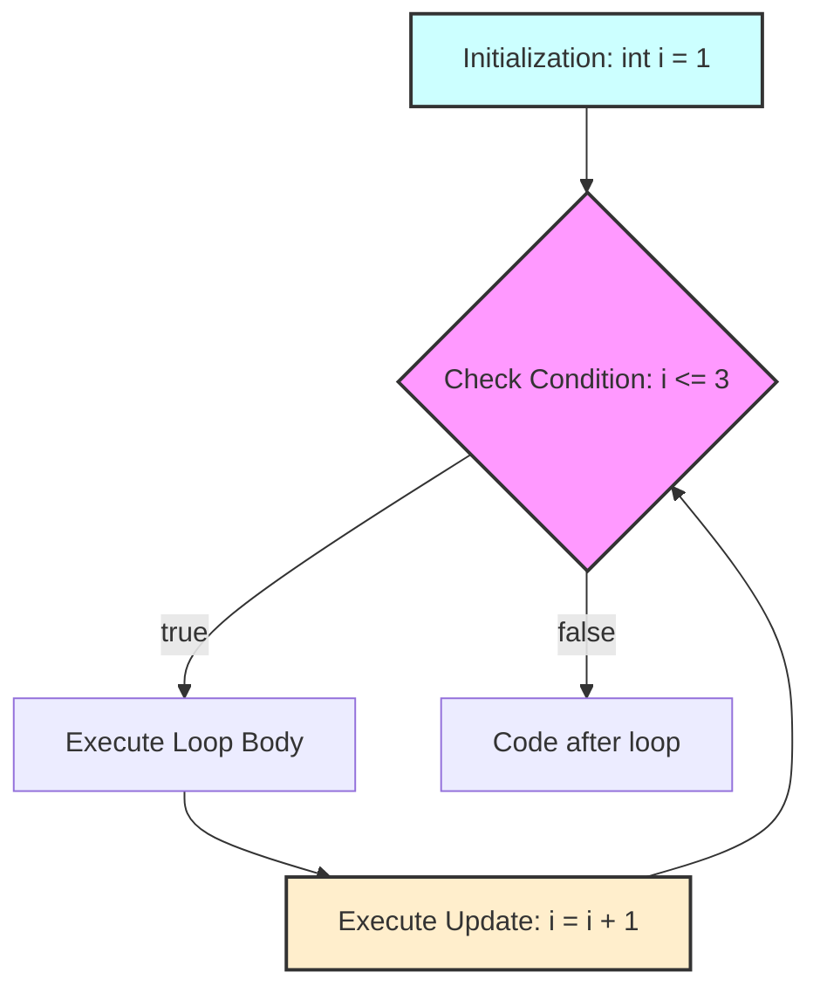

<!--
author:   Sayan Goswami
email:	sgoswami@smcm.edu
version:  0.1.0
language: en
narrator: US English Female

comment:  For loops and variable scope

import: https://raw.githubusercontent.com/liaScript/mermaid_template/master/README.md

link: https://fonts.googleapis.com/css2?family=Fira+Sans:ital,wght@0,100;0,200;0,300;0,400;0,500;0,600;0,700;0,800;0,900;1,100;1,200;1,300;1,400;1,500;1,600;1,700;1,800;1,900&display=swap

link: https://fonts.googleapis.com/css2?family=Fira+Code:wght@300..700&family=Fira+Sans:ital,wght@0,100;0,200;0,300;0,400;0,500;0,600;0,700;0,800;0,900;1,100;1,200;1,300;1,400;1,500;1,600;1,700;1,800;1,900&display=swap

link: https://cdn.jsdelivr.net/gh/sayangoswami/Teaching@main/LiaCourses/theme.css

import: https://raw.githubusercontent.com/LiaScript/CodeRunner/master/README.md

-->


# More Loops and Scope


- `while` Loop Recap
	
- The `for` Loop
	
- `while` vs. `for`: When to Use Which?
	
- The **Accumulator pattern** of loops
	
- Variable Scope
	
- Worksheets
	

---

## `while` Loop Recap

Last time, we learned about the `while` loop. It's our tool for **repetition**.

It's defined by **3 Key Parts** for counting:

1. **Initialization:** A variable is set up _before_ the loop.
	
2. **Condition:** The loop checks this boolean expression _before_ each run.
	
3. **Update:** The variable is changed _inside_ the loop (to eventually stop it).
	

---

## `while` Loop Recap: Example

Let's print numbers 1 through 3.


```java
public class Main {
	public static void main(String[] args) {
		
		// 1. INITIALIZATION
		int count = 1;

		// 2. CONDITION
		while (count <= 3) {
			System.out.println(count);
			
			// 3. UPDATE
			count = count + 1;
		}

		System.out.println("Done!");
	}
}
```
@LIA.java(Main)


This **"Initialize, Condition, Update"** pattern is extremely common for loops that _count_.

---

## The `for` Loop

This "counter" pattern is so common that Java gives us a special loop just for it!

The **`for` loop** is a "definite" loop. You use it when you know (or can calculate) _exactly_ how many times you want to run.

It combines the **Initialization, Condition, and Update** all into one line.

---

## Anatomy of a `for` Loop

Here's how it's built:


```java
public class Main {
	public static void main(String[] args) {
		
		//   ( 1. Init  ;  2. Condition ;  3. Update )
		for (int i = 1; i <= 3; i = i + 1) {
			
			// This is the loop body.
			// It runs as long as the condition is true.
			System.out.println(i);
			
		}
	}
}
```
@LIA.java(Main)

- `int i = 1`: **Initialization**. Happens **only once** when the loop starts.
	
- `i <= 3`: **Condition**. Checked **before** every loop (including the first).
	
- `i = i + 1`: **Update**. Happens **after** the loop body runs.
	

---

## `for` Loop Flowchart

The execution order is important!

Code snippet



**The Cycle:** (Check -> Body -> Update) -> (Check -> Body -> Update) -> ...

---

## Quick Tip: The `++` Operator

In loops, you'll almost always see `i++` instead of `i = i + 1`.

- `i++` is just shorthand for `i = i + 1` (increment by 1).
	
- `i--` is shorthand for `i = i - 1` (decrement by 1).
	


```java
// This...
for (int i = 1; i <= 3; i = i + 1) { ... }

// ...is the same as this:
for (int i = 1; i <= 3; i++) { ... }
```

It's just the standard way to write counter loops.

---

## `for` Loop Example: Counting Down

Let's print a countdown from 5, but only the odd numbers.


```java
public class Main {
	public static void main(String[] args) {

		// Start at 5; keep going while >= 1; subtract 2 each time.
		for (int num = 5; num >= 1; num = num - 2) {
			System.out.println(num);
		}

		System.out.println("Done!");

	}
}
```
@LIA.java(Main)


---

## `while` vs. `for`

When should you use each one?

<!-- data-type="none" data-sortable="false" -->
| while Loop (Indefinite)																		 | for Loop (Definite)															   |
| ----------------------------------------------------------------------------------------------- | --------------------------------------------------------------------------------- |
| **Best for:** When you don't know how many times to loop. You just have a _stopping condition_. | **Best for:** When you know exactly how many times to loop (or can calculate it). |
| "Keep looping **while** the user hasn't typed 'quit'."										  | "Loop **for** every number from 1 to 10."										 |
| "Keep looping **while** the game is not over."												  | "Loop **for** all 50 states."													 |
| `int i = 0;`<br><br>  <br><br>`while (i < 10) { ... i++; }`									 | `for (int i = 0; i < 10; i++) { ... }`											|

**Rule of Thumb:** If it's a "counter" loop, use a `for` loop. It's cleaner!

**Note**: Both loops are *equally expressive* - For all situations, you can use either.

---

## A New Pattern: The Accumulator

Loops aren't just for printing. We can use them to **calculate** a single value by "accumulating" results over time.

This is the **Accumulator Pattern**.

**The Big Idea:**

1. Initialize a "total" variable **before** the loop.
	
2. In the loop, **update** the "total" variable.
	
3. After the loop, the "total" variable holds the final result.
	

---

## Accumulator: The "Boilerplate"

Here is the general structure for solving these problems:


```java
public class Main {
	public static void main(String[] args) {

		// 1. INITIALIZE the "total" variable
		//	(Start with 0 for sums, 1 for products, "" for strings)
		<type> total = <initial_value>;

		// 2. LOOP a known number of times
		for (int i = ...; ...; ...) {
			
			// Get/calculate the "current" value
			<type> currentValue = ...; // (Often, 'i' *is* the current value)

			// 3. ACCUMULATE (update) the total
			total = total + currentValue; // or total = total * ... etc.
		}

		// 4. RESULT: Use the total *after* the loop
		System.out.println("The final result is: " + total);

	}
}
```
@LIA.java(Main)

---

## Accumulator Example 1: Sum

**Problem:** Find the sum of all numbers from 1 to 5. ($1 + 2 + 3 + 4 + 5$)


```java
public class Main {
	public static void main(String[] args) {

		int sum = 0; // 1. Initialize!

		for (int i = 1; i <= 5; i++) {
			// 'i' is the currentValue (1, then 2, then 3...)
			
			sum = sum + i; // 3. Accumulate!
		}

		System.out.println("The sum is: " + sum); // 4. Result!

	}
}
```
@LIA.java(Main)


**Trace**

<!-- data-type="none" data-sortable="false" -->
|i (current value)|sum (before update)|sum = sum + i|sum (after update)|
|---|---|---|---|
|(loop starts)|0|-|0|
|1|0|`0 + 1`|1|
|2|1|`1 + 2`|3|
|3|3|`3 + 3`|6|
|4|6|`6 + 4`|10|
|5|10|`10 + 5`|15|
|(loop ends)|15|-|15|

---

## Accumulator Example 2: Product

**Problem:** Find the factorial of 4. ($4! = 1 \times 2 \times 3 \times 4$)

**Question:** What should we initialize `product` to?

- If we start at 0, the answer will always be 0! ($0 \times 1 \times 2...$)
	
- We must start at **1**.
	


```java
public class Main {
	public static void main(String[] args) {

		int product = 1; // 1. Initialize to 1!

		for (int i = 1; i <= 4; i++) {
			product = product * i; // 3. Accumulate by multiplying
		}

		System.out.println("4! is: " + product); // 4. Result!

	}
}
```
@LIA.java(Main)


---

## Accumulator Example 3: String Building

**Problem:** Ask the user for 3 words and combine them into a sentence.


```java
public class Main {
	public static void main(String[] args) {

		String sentence = ""; // 1. Initialize to an empty string!
		Scanner input = new Scanner(System.in);

		for (int i = 1; i <= 3; i++) {
			System.out.print("Enter a word: ");
			String word = input.next();
			sentence = sentence + word + " "; // 3. Accumulate!
		}

		System.out.println("Your sentence: " + sentence);

	}
}
```
@LIA.java(Main)


---

## A New Concept: Variable Scope

We're starting to use a lot of variables. We need to know:

- Where are they "born"?
	
- Where can they be "seen"?
	
- When do they "die"?
	

**Scope:** The "lifetime" and "visibility" of a variable. It's the part of your code where a variable exists and can be accessed.

> **Simple Rule:** _Where_ you declare a variable determines its scope. There are four main places:
>
> 1. **Class Scope:** Inside a class, but outside a method.
>
> 2. **Object Scope:** Inside a class, but outside a method.
>
> 3. **Method Scope:** Inside a method, but outside a block.
>
> 4. **Block Scope:** Inside a `{...}` block (like `if` or a `while`).


---

## Scope: Object, Method, and Block

- **Class Scope (Static Variables):** Declared inside a `class` but _outside_ any method.

  - **Born:** When the program starts running.
  - **Lives:** As long as the program is running.
  - **Seen:** By _all_ methods in that class.

- **Object Scope (Instance Variables):** Declared inside a `class` but _outside_ any method.  

  - **Born:** When the object is created (with `new`).

  - **Lives:** As long as the object exists.

  - **Seen:** By _all_ methods in that class.
		
- **Method Scope (Local Variables):** Declared inside a `method`. 

  - **Born:** When the method is called.

  - **Lives:** Until the method finishes (`return`).

  - **Seen:** Only by code _inside_ that method.
		
- **Block Scope (Local Variables):** Declared inside `{...}`. 

  - **Born:** When the block is entered.

  - **Lives:** Until the block's closing `}`.

  - **Seen:** Only by code _inside_ that block.
		

## Scope: Object, Method, and Block (contd.)

```java
public class MyClass {

	static int c = 5;   // 1. CLASS Scode
	int x = 10; // 2. OBJECT Scope (Instance Variable)

	public void myMethod() {
		int y = 20; // 3. METHOD Scope
		
		System.out.println(x); // OK! 'x' is visible.

		if (y > 5) {
			int z = 30; // 4. BLOCK Scope
			System.out.println(y); // OK! 'y' is visible.
			System.out.println(z); // OK! 'z' is visible.
		}
		
		System.out.println(y); // OK! 'y' is still visible.
		// System.out.println(z); // ERROR! 'z' is out of scope.
	}
	
	public void anotherMethod() {
		System.out.println(x); // OK! 'x' is visible here too.
		// System.out.println(y); // ERROR! 'y' is out of scope.
	}
}
```

_This is why our accumulator `total` _must_ be declared **before** the loop! (It has method scope, not just block scope)._

---

## Scope: The `for` Loop (Very Important!)

This is a key difference between our `while` and `for` loop patterns.

The for Loop:

The variable i is declared inside the for loop's parentheses. Its scope is only the loop.


```java
public class Main {
	public static void main(String[] args) {

		for (int i = 0; i < 5; i++) {
			System.out.println(i); // OK
		}
		// System.out.println(i); // ERROR! 'i' is out of scope.
	}
}
```
@LIA.java(Main)

The while Loop Pattern:

The variable j is declared outside the loop. Its scope is the whole method (or block) it was declared in.


```java
public class Main {
	public static void main(String[] args) {
		
		int j = 0;
		while (j < 5) {
			System.out.println(j); // OK
			j++;
		}
		System.out.println(j); // OK! 'j' is still in scope.
		// (It will print 5)
	}
}
```
@LIA.java(Main)

---

## Summary: What We Learned

- **`for` Loops (Definite):** A clean way to write "counter" loops. It bundles **Init, Condition, and Update** into one line.
	
- **Accumulator Pattern:** A powerful technique to calculate a single value (like a sum, product, or new string) over many loop cycles.
	
- **Scope (Object, Method, Block):** A variable's "lifetime." It only exists in the area where it was declared.
	
	- This is why `for` loop counters (`i`) _cannot_ be used after the loop!
		


---

## Worksheet A: Guess the Output 

What is the _exact_ output of the following code snippets? If it causes an error, write "ERROR" and explain why.

#### **1. Snippet A**


```java
public class Main {
	public static void main(String[] args) {
		for (int i = 0; i < 4; i++) {
			System.out.print(i);
		}
		System.out.println("!");
	}
}
```

**Output:** ____________________


#### **2. Snippet B**


```java
public class Main {
	public static void main(String[] args) {
		int total = 0;
		for (int k = 1; k <= 3; k++) {
			total = total + k;
		}
		System.out.println(total);
	}
}
```

**Output:** ____________________

#### **3. Snippet C**


```java
public class Main {
	public static void main(String[] args) {
		int a = 3;
		if (a < 5) {
			int b = 10;
			System.out.println(a);
		}
		System.out.println(b);
	}
}
```

**Output:** ____________________

#### **4. Snippet D**


```java
public class Main {
	public static void main(String[] args) {
		for (int x = 1; x <= 2; x++) {
			System.out.print(x);
		}
		System.out.println(x);
	}
}
```

**Output:** ______

#### **5. Snippet E**


```java
public class Main {
	public static void main(String[] args) {
		String word = "a";
		for (int m = 0; m < 3; m++) {
			word = word + "b";
		}
		System.out.println(word);
	}
}
```

**Output:** ____________________

---

## Worksheet B: Write the Code 

#### **1. The `N` Printer**

- Ask the user for a number, `n`.
	
- Using a `for` loop, print all numbers from `1` to `n` (inclusive).
	
- **Example Input:** `5`
	
- **Example Output:** `1 2 3 4 5`

```java
import java.util.Scanner;
public class Main {
	public static void main(String[] args) {
		Scanner sc = new Scanner(System.in);

		// your code here ...

	}
}
```
@LIA.java(Main)

#### **2. Password Guesser**

- (This is a `while` loop problem!)
	
- Keep asking the user "Enter password:"
	
- Keep looping **as long as** the user's input is _not_ equal to `"java"`.
	
- When they finally type `"java"`, print "Access Granted" and stop.

```java
import java.util.Scanner;
public class Main {
	public static void main(String[] args) {
		Scanner sc = new Scanner(System.in);

		// your code here ...

	}
}
```
@LIA.java(Main)
	

#### **3. Evens Only**

- Using a `for` loop, print all **even** numbers from `2` up to `20` (inclusive).
	
- **Expected Output:** `2 4 6 8 10 12 14 16 18 20`

```java
public class Main {
	public static void main(String[] args) {

		// your code here ...

	}
}
```
@LIA.java(Main)
	

#### **4. The Accumulator**

	
- Ask the user for a number, `n`.
	
- Use a `for` loop and the **accumulator pattern** to calculate the **sum of all odd numbers** from 1 to `n`.
	
- **Example Input:** `10`
	
- **Example Output:** `The sum is: 18` (because $1+3+5+9=18$)

```java
import java.util.Scanner;
public class Main {
	public static void main(String[] args) {
		Scanner sc = new Scanner(System.in);

		// your code here ...
		
	}
}
```
@LIA.java(Main)

