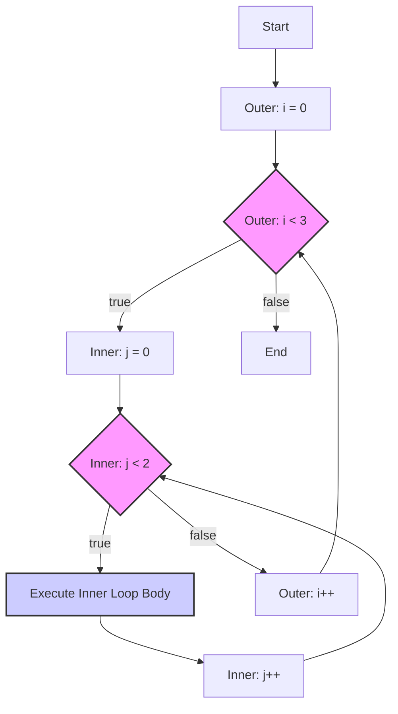
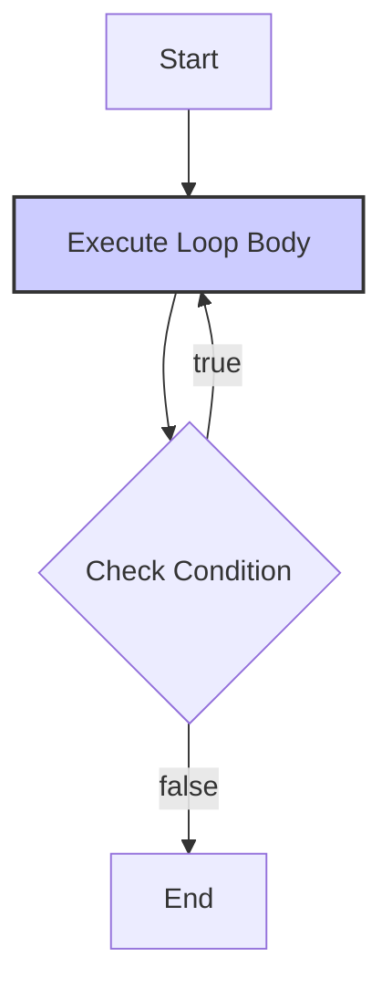

<!--
author:   Sayan Goswami
email:	sgoswami@smcm.edu
version:  0.1.0
language: en
narrator: US English Female

comment:  Advanced Loops

import: https://raw.githubusercontent.com/liaScript/mermaid_template/master/README.md

link: https://fonts.googleapis.com/css2?family=Fira+Sans:ital,wght@0,100;0,200;0,300;0,400;0,500;0,600;0,700;0,800;0,900;1,100;1,200;1,300;1,400;1,500;1,600;1,700;1,800;1,900&display=swap

link: https://fonts.googleapis.com/css2?family=Fira+Code:wght@300..700&family=Fira+Sans:ital,wght@0,100;0,200;0,300;0,400;0,500;0,600;0,700;0,800;0,900;1,100;1,200;1,300;1,400;1,500;1,600;1,700;1,800;1,900&display=swap

link: https://cdn.jsdelivr.net/gh/sayangoswami/Teaching@main/LiaCourses/theme.css

import: https://raw.githubusercontent.com/LiaScript/CodeRunner/master/README.md

-->


# Advanced Loops

---

## Agenda

- **Part 1:** Nested Loops (A loop inside a loop)
    
- **Part 2:** The `do-while` Loop (The "third" loop type)
    
- **Part 3:** Loop Control Statements (`break` and `continue`)
    
- **Part 4:** Common Pitfalls: The "Off-by-One" Error
    
- **Part 5:** Worksheet
    

---

## Part 1: Nested Loops

So far, we've used single loops. A **nested loop** is a loop that exists _inside_ the body of another loop.

This is the key to working with 2D data, like grids, tables, and images.

The Concept:

For every one time the outer loop runs, the inner loop runs to full completion.


```java
for (int i = 0; i < 3; i++) {
    // This code runs 3 times (i=0, i=1, i=2)
    
    for (int j = 0; j < 2; j++) {
        // This code runs 3 * 2 = 6 times!
        // (i=0, j=0), (i=0, j=1)
        // (i=1, j=0), (i=1, j=1)
        // (i=2, j=0), (i=2, j=1)
    }
}
```

---

## The Clock Analogy

The most famous analogy for a nested loop is a **clock**.

- The **Outer Loop** is the **Hour Hand**.
    
- The **Inner Loop** is the **Minute Hand**.
    

The outer loop (hour hand) ticks once.

Then, the inner loop (minute hand) must complete its entire cycle (all 60 minutes).

...before the outer loop ticks again.




---

## Nested Loop Example: The Grid

The "Hello, World!" of nested loops is printing a grid. The outer loop controls the **rows**, and the inner loop controls the **columns**.


```java
public class Main {
    public static void main(String[] args) {
        // We want 3 rows and 4 columns
        int rows = 3;
        int cols = 4;

        for (int i = 0; i < rows; i++) {
            // This loop body runs 3 times (once per row)
            
            for (int j = 0; j < cols; j++) {
                // This loop prints one row
                System.out.print("* ");
            }
            
            // At the end of a row, print a newline
            // to move to the next one!
            System.out.println();
        }
    }
}
```
@LIA.java(Main)


---

## Tracing the Grid

Let's trace the execution. `i` is the row, `j` is the column.

<!-- data-type="none" data-sortable="false" -->
|i|j|Output|
|---|---|---|
|0|0|`*`|
||1|`*`|
||2|`*`|
||3|`*`|
||(loop ends)|(prints newline)|
|1|0|`*`|
||1|`*`|
||2|`*`|
||3|`*`|
||(loop ends)|(prints newline)|
|2|0|`*`|
||1|`*`|
||2|`*`|
||3|`*`|
||(loop ends)|(prints newline)|

---

## Nested Loop Example: The Triangle

A common pattern is when the **inner loop's condition** depends on the **outer loop's variable**.

Let's print a triangle. The number of stars in each row `j` depends on which row `i` we are on.


```java
public class Main {
    public static void main(String[] args) {
        int size = 5;

        // Outer loop: controls the row number (1, 2, 3, 4, 5)
        for (int i = 1; i <= size; i++) {
            
            // Inner loop: prints 'i' stars
            // Row 1 (i=1): prints 1 star (j=1)
            // Row 2 (i=2): prints 2 stars (j=1, j=2)
            // ...
            for (int j = 1; j <= i; j++) {
                System.out.print("*");
            }
            System.out.println();
        }
    }
}
```
@LIA.java(Main)

---

## Part 2: The `do-while` Loop

We know `while` and `for`. The final loop type is `do-while`.

- A `while` loop checks its condition **at the start**.
    
    - "Check-then-run." It might run **0 times**.
        
- A `do-while` loop checks its condition **at the end**.
    
    - "Run-then-check." It is _guaranteed_ to run **at least once**.
        

---

## `do-while` Syntax & Flowchart

Notice the syntax: the `do` keyword, the body, and the `while` check _after_ the body. **Don't forget the semicolon!**


```java
// Syntax:
do {
    // This code block
    // is guaranteed
    // to run at least 1 time.
    
} while (condition);
```

**Flowchart:**




Compare to a `while` loop, where the `Check Condition` diamond comes _before_ the `Execute Loop Body` box.

---

## `do-while` Example: The "Play Again?" Menu

When do you _need_ to run code at least once?

A classic example is a "Do you want to play again?" menu. You have to play the game (or run the code) _at least once_ before you can ask the user if they want to do it _again_.


```java
import java.util.Scanner;
public class Main {
    public static void main(String[] args) {
        Scanner input = new Scanner(System.in);
        String playAgain;

        do {
            // 1. Run the main part of your program
            System.out.println("...Playing the game...");
            System.out.println("...Game over!...");
            
            // 2. Ask the user if they want to repeat
            System.out.print("Play again? (y/n): ");
            playAgain = input.next();

        } while (playAgain.equals("y")); // 3. Check condition at the end

        System.out.println("Thanks for playing!");
    }
}
```
@LIA.java(Main)

---

## Part 3: Loop Control Statements

`break` and `continue` are keywords that let you "break the rules" of a loop.

They give you manual control over the loop's execution.

- `break`: **Exits the loop entirely.**
    
    - "I'm done. Get me out of here."
        
- `continue`: **Skips the rest of the current iteration** and jumps to the next one.
    
    - "I'm done with _this one_. Move on to the next."
        

---

## `break`: The "Emergency Exit"

The `break` statement immediately terminates the **innermost** loop it's in.

**Use Case:** Searching. Why keep looping after you've found what you're looking for?


```java
import java.util.Scanner;
public class Main {
    public static void main(String[] args) {
        Scanner sc = new Scanner(System.in);
        int n = sc.nextInt();

        // Problem: check if n is prime
        boolean isPrime = true;
        for (int i = 2; i < n; i++) {
            System.out.println("Checking " + i);
            if (n % i == 0) {
                isPrime = false;
                break;
            }
        }       
        if (isPrime) System.out.println("" + n + " is prime");
        else System.out.println("" + n + " is not prime");
    }
}
```
@LIA.java(Main)

(Notice that when n is not prime, it always exits before reaching n-1. `break` saved us time!)

---

## `continue`: The "Skip This One"

The `continue` statement skips the rest of the code _in the current iteration_ and moves to the next iteration.

**Use Case:** Skipping invalid or uninteresting items.


```java
public class Main {
    public static void main(String[] args) {
        // Problem: Print all numbers from 1 to 10,
        // but skip the ones divisible by 3.

        for (int i = 1; i <= 10; i++) {
            
            if (i % 3 == 0) {
                continue; // Skip the rest of this iteration.
                        // Go directly back to the `i++`
            }
            
            // This code is skipped if 'continue' runs
            System.out.print(i + " ");
        }
    }
}
```
@LIA.java(Main)

---

## Part 4: Common Pitfall: Off-by-One Errors

This is the **most common bug** in all of programming.

An "Off-by-One" error is when your loop runs one _too many_ or one _too few_ times.

It's almost always a bug in your **condition**:

- Using `<` when you meant `<=`
    
- Using `>` when you meant `>=`
    

Or your **initialization**:

- Starting at `i = 1` when you meant `i = 0`
    

---

## How to Fix Off-by-One Errors

**Question:** "I need to loop 10 times." How do I write the `for` loop?

Option 1: The "0-indexed" way (MOST COMMON)

Starts at 0, uses <


```java
for (int i = 0; i < 10; i++) {
    // Runs for i = 0, 1, 2, 3, 4, 5, 6, 7, 8, 9
    // (That's 10 iterations)
}
```

Option 2: The "1-indexed" way

Starts at 1, uses <=


```java
for (int i = 1; i <= 10; i++) {
    // Runs for i = 1, 2, 3, 4, 5, 6, 7, 8, 9, 10
    // (Also 10 iterations)
}
```

**Think:** "Do I want to include the last number?"

- "Print numbers 1 **to** 10" -> `i = 1; i <= 10`
    
- "Loop 10 **times**" -> `i = 0; i < 10`
    

When in doubt, "run" the code in your head for the first (e.g., `i=0`) and last (e.g., `i=9`) iterations.

---

## Summary: What We Learned Today

- **Nested Loops:** A loop-in-a-loop, perfect for 2D grids and patterns. The outer loop ticks, the inner loop "completes."
    
- **`do-while` Loop:** The "run-then-check" loop. It is **guaranteed** to run at least once.
    
- **`break`:** The "emergency exit." Kills the loop immediately.
    
- **`continue`:** The "skip button." Skips the current iteration and moves to the next.
    
- **Off-by-One Errors:** The most common bug. Double-check your `<` vs. `<=` conditions!
    

---


## Programming Worksheet: Advanced Loops

**Instructions:** For each pair of problems, your instructor will code the solution for the "My Problem." Your task is to use the same logic and patterns to solve the "Your Problem" on your own.

-----

### Pair 1: Nested Loops (Grid Coordinates)

**1A: My Problem**
Write a nested loop that prints all coordinate pairs `(i, j)` for a 3x3 grid (from `(0, 0)` to `(2, 2)`).

```java
public class Main {
    public static void main(String[] args) {
        // Your code below ...
    }
}
```
@LIA.java(Main)

**1B: Your Problem**
Write a nested loop that prints a multiplication table from $1 \times 1$ up to $5 \times 5$.
*Hint: The output should look like `1 x 1 = 1`, `1 x 2 = 2` ... up to `5 x 5 = 25`.*

```java
public class Main {
    public static void main(String[] args) {
        // Your code below ...
    }
}
```
@LIA.java(Main)

-----

### Pair 2: Nested Loops (Dependent Triangle)

**2A: My Problem**
Write a program that asks the user for a number n and uses a nested loop to print a triangle of **numbers**, where each row `i` prints numbers from 1 up to `i`.


*for n = 4, Output:*

```
1 
1 2 
1 2 3 
1 2 3 4 
```

```java
import java.util.Scanner;
public class Main {
    public static void main(String[] args) {
        Scanner sc = new Scanner(System.in);
        // Your code below ...
    }
}
```
@LIA.java(Main)

**2B: Your Problem**
Write a nested loop to print a triangle of **numbers**, where each row `i` prints the number `i`... `i` times.

*Hint: What variable should you print in the inner loop?*
*Example Output for size = 4:*

```
1
2 2
3 3 3
4 4 4 4
```

```java
import java.util.Scanner;
public class Main {
    public static void main(String[] args) {
        Scanner sc = new Scanner(System.in);
        // Your code below ...
    }
}
```
@LIA.java(Main)

-----

### Pair 3: `break` Statement

**4A: My Problem**
Write an infinite `for` loop that iterates from 1. Find and print the **first** number that is divisible by both 21 and 31. Once you find it, use `break` to stop the loop.

```java
public class Main {
    public static void main(String[] args) {
        // Your code below ...
    }
}
```
@LIA.java(Main)

**4B: Your Problem**
Ask the user to enter numbers one at a time. Use a `while(true)` loop (an infinite loop) to find the sum of all numbers entered. If the user enters a **negative number**, use `break` to exit the loop and print the final sum.
(Do *not* include the negative number in the sum).

```java
import java.util.Scanner;
public class Main {
    public static void main(String[] args) {
        Scanner sc = new Scanner(System.in);
        // Your code below ...
    }
}
```
@LIA.java(Main)

-----

### Pair 4: `continue` Statement

**5A: My Problem**
Write a `for` loop that iterates from 1 to 20. Print the number, but use `continue` to **skip** all numbers that are **even**.

```java
public class Main {
    public static void main(String[] args) {
        // Your code below ...
    }
}
```
@LIA.java(Main)

**5B: Your Problem**
Write a `for` loop that iterates from 1 to 20. Print the number, but use `continue` to **skip** all numbers that are divisible by **3** or **5**.
*Hint: `if (i % 3 == 0 || i % 5 == 0)`*

```java
public class Main {
    public static void main(String[] args) {
        // Your code below ...
    }
}
```
@LIA.java(Main)