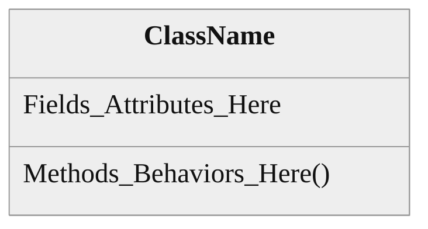
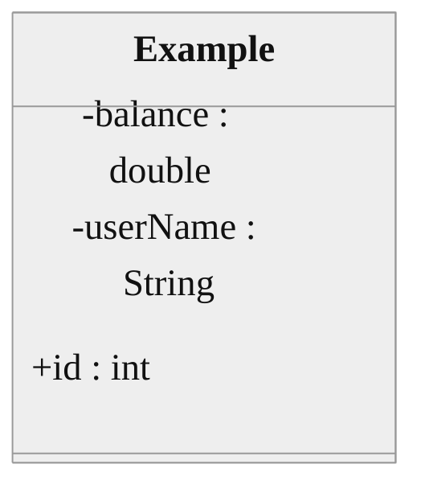
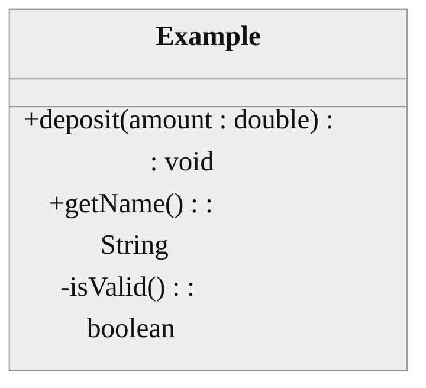
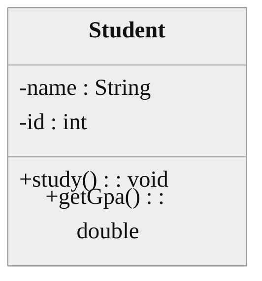
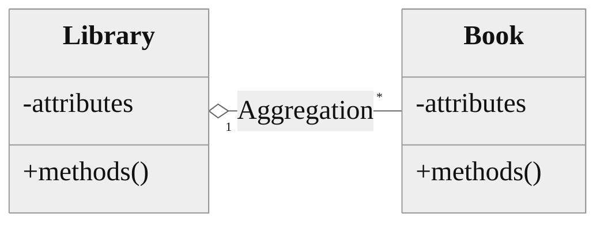
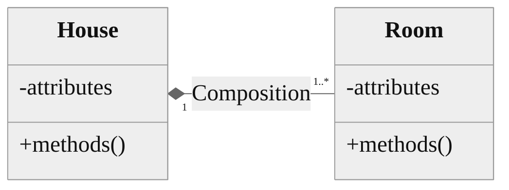
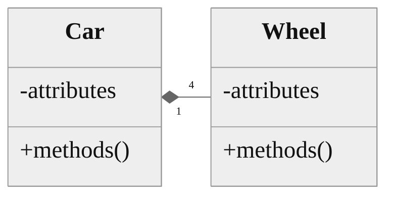
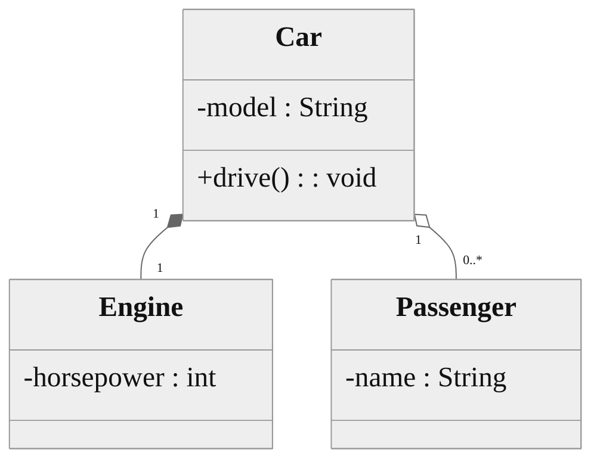

<!--
author:   Sayan Goswami
email:	sgoswami@smcm.edu
version:  0.1.0
language: en
narrator: US English Female

comment:  UML Class Diagrams

import: https://raw.githubusercontent.com/liaScript/mermaid_template/master/README.md

link: https://fonts.googleapis.com/css2?family=Fira+Sans:ital,wght@0,100;0,200;0,300;0,400;0,500;0,600;0,700;0,800;0,900;1,100;1,200;1,300;1,400;1,500;1,600;1,700;1,800;1,900&display=swap

link: https://fonts.googleapis.com/css2?family=Fira+Code:wght@300..700&family=Fira+Sans:ital,wght@0,100;0,200;0,300;0,400;0,500;0,600;0,700;0,800;0,900;1,100;1,200;1,300;1,400;1,500;1,600;1,700;1,800;1,900&display=swap

link: https://cdn.jsdelivr.net/gh/sayangoswami/Teaching@main/LiaCourses/theme.css

import: https://raw.githubusercontent.com/LiaScript/CodeRunner/master/README.md

-->


# Visualizing Code: Introduction to UML


## The "Why"

- **The Problem:** Code files can get huge. It is hard to see the "big picture" just by looking at lines of text.
- **The Analogy:**
    - An engineer finalizes the **blueprints** before building.
- **The Solution:** **UML** (Unified Modeling Language).
- It is the standard way software engineers draw diagrams to plan and document their code before (and after) they write it.


## The Class Box

A Class Diagram is represented by a rectangle divided into **three specific sections**.



1.  **Top Section:** The **Class Name**. (Always capitalized, centered).
2.  **Middle Section:** The **Fields** (Attributes/Instance Variables).
3.  **Bottom Section:** The **Methods** (Behaviors/Functions).


## Visibility Modifiers (The Symbols)

In Java, we use keywords like `public` and `private`. In UML, we use symbols.

<!-- data-type="none" data-sortable="false" -->
| Java Keyword | UML Symbol | Meaning |
| :--- | :---: | :--- |
| `private` | **`-`** | Only accessible inside this class. |
| `public` | **`+`** | Accessible by everyone. |

* **Best Practice:**

  * Fields are almost always Private (`-`).
  * Methods are usually Public (`+`).


## Writing Fields (Attributes)

The syntax in UML is slightly different than Java. We put the variable name *first*, then the type.

**Format:**
`visibility name : type`



- **Java:** `private double balance;` $\rightarrow$ **UML:** `- balance : double`
- **Java:** `private String userName;` $\rightarrow$ **UML:** `- userName : String`


## Writing Methods

Similarly, for methods, we list the parameters and the return type at the end.

**Format:**
`visibility methodName(paramName : type) : returnType`



- **Java:** `public void deposit(double amount)`
- **UML:** `+ deposit(amount : double) : void`


## Putting it Together: The `Student` Class

Let's look at a complete class diagram mapping directly to code.

**The Code:**

```java
public class Student {
    private String name;
    private int id;
    
    public void study() { ... }
    public double getGpa() { ... }
}
```

**The UML Diagram:**




## Relationships (Connecting Classes)

Classes rarely exist in isolation. They interact.
In CS1, we focus on the **"Has-A"** relationship.

- A Car *has an* Engine.
- A Library *has* Books.

We represent these connections with **lines** connecting the class boxes. There are two types of "Has-A" relationships: **Aggregation** and **Composition**.


## Aggregation (The "Weak" Link)

* **Concept:** "Has-a", but the objects are independent. If the main object is destroyed, the other object **survives**.
* **Symbol:** An **Open Diamond** `<>--` on the container side.
* **Example:** A `Library` and a `Book`. A book's existence is not tied to the library.

<!-- end list -->




## Composition (The "Strong" Link)

* **Concept:** "Part-of". The objects are dependent. If the main object is destroyed, the part is **destroyed too**.
* **Symbol:** A **Filled Diamond** `◆-` on the container side.
* **Example:** A `House` and a `Room`. You cannot have a "Kitchen" floating in space without a House.

<!-- end list -->




## Cardinality (Multiplicity)

We add numbers to the lines to show **how many** objects are involved.

* `1` : Exactly one.
* `0..1` : Zero or one (Optional).
* `*` or `0..*` : Zero to many.
* `1..*` : One to many (At least one).

**Example:** A `Car` has 4 `Wheels`.




## Full Example: The "Car" System

Let's diagram a Car system.

1.  A `Car` is composed of exactly 1 `Engine` (Composition - Strong).
2.  A `Car` can have `0..*` `Passengers` (Aggregation - Weak/Independent).

<!-- end list -->




## Summary Cheat Sheet

<!-- data-type="none" data-sortable="false" -->
| Concept | Syntax/Symbol |
| :--- | :--- |
| **Public** | `+` |
| **Private** | `-` |
| **Field Syntax** | `name : type` |
| **Method Syntax** | `name(param : type) : return` |
| **Aggregation** (Independent) | `ClassA o-- ClassB` (Open Diamond) |
| **Composition** (Dependent) | `ClassA *-- ClassB` (Filled Diamond) |

