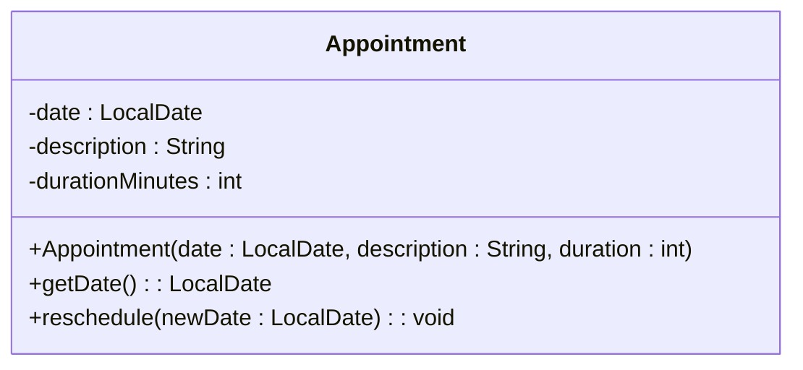
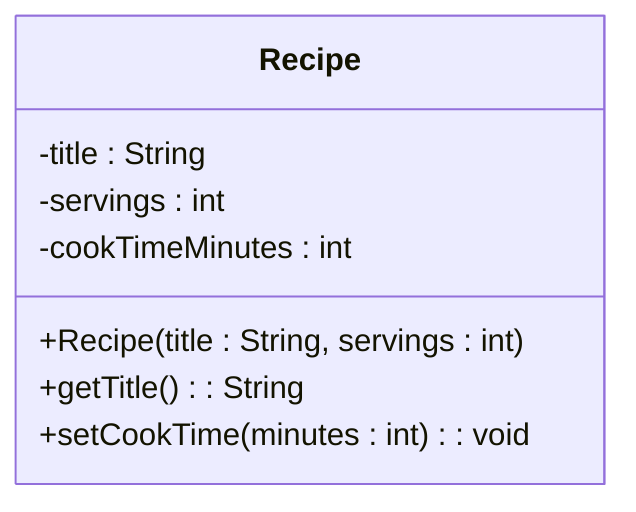
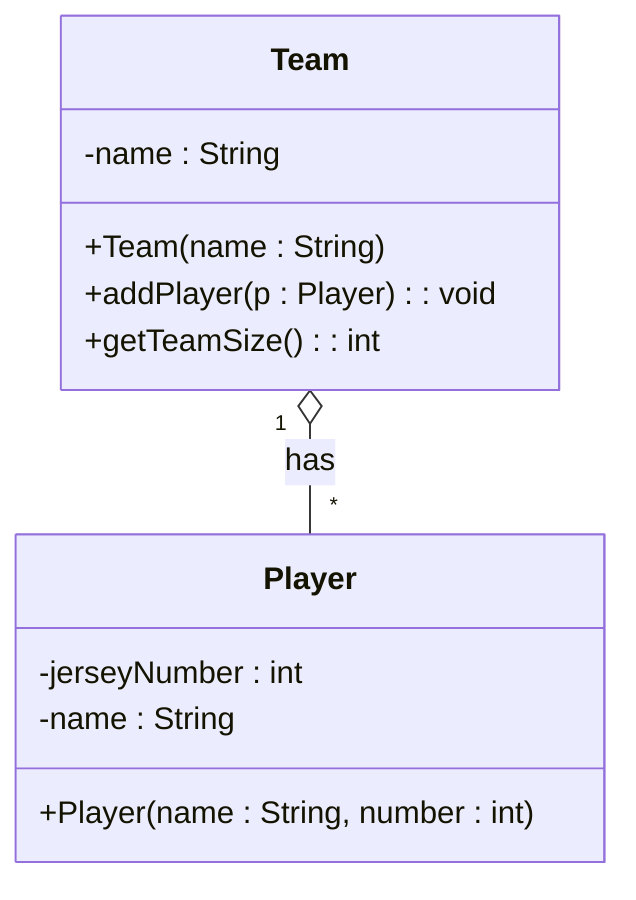
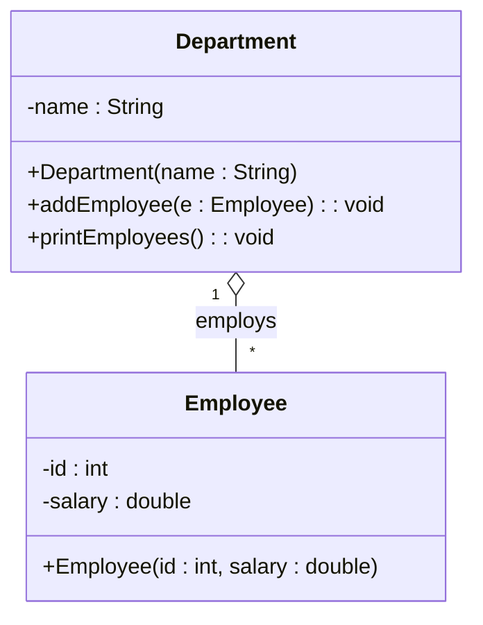
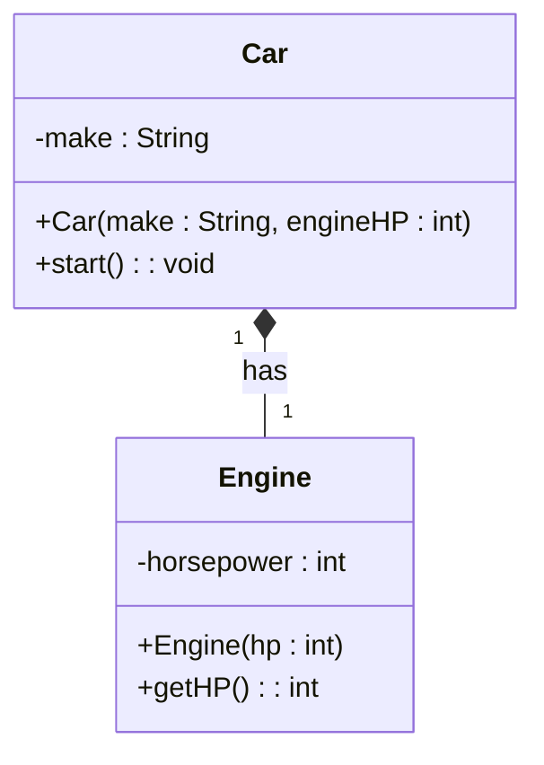
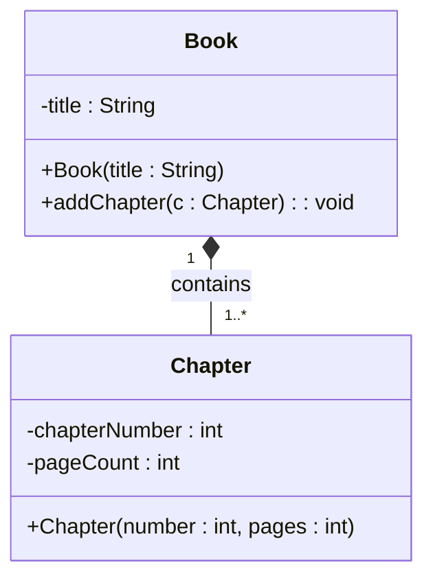

<!--
author:   Sayan Goswami
email:    sgoswami@smcm.edu
version:  0.1.0
language: en
narrator: US English Female

comment:  Worksheet - UML to Code

link: https://fonts.googleapis.com/css2?family=Fira+Sans:ital,wght@0,100;0,200;0,300;0,400;0,500;0,600;0,700;0,800;0,900;1,100;1,200;1,300;1,400;1,500;1,600;1,700;1,800;1,900&display=swap

link: https://fonts.googleapis.com/css2?family=Fira+Code:wght@300..700&family=Fira+Sans:ital,wght@0,100;0,200;0,300;0,400;0,500;0,600;0,700;0,800;0,900;1,100;1,200;1,300;1,400;1,500;1,600;1,700;1,800;1,900&display=swap

link: https://cdn.jsdelivr.net/gh/sayangoswami/Teaching@main/LiaCourses/theme.css

import: https://raw.githubusercontent.com/LiaScript/CodeRunner/master/README.md

import: https://raw.githubusercontent.com/liaScript/mermaid_template/master/README.md

-->

## UML to Code Translation Worksheet

**Instructions:** For each problem, you must create the required Java classes. For methods, only write the **signature** (method stub) unless a specific implementation is required (like setting fields in the constructor). Pay close attention to the **visibility** symbols (`+` / `-`) and **relationships** (diamond arrows).

### Basic Structure & Visibility

This pair focuses on correctly translating fields, visibility, and constructors.

#### 1A: The Appointment Scheduler

**Task:** Create the `Appointment` class. Note the use of the `LocalDate` type.




Your solution must correctly include:

1. The three **private** field declarations with correct types.
    
2. The **constructor** that accepts and sets all three fields.
    
3. The two **public** method *stubs* - methods with only signature but no (or minimal) implementation.
    


```java
class Appointment {
	private LocalDate date;
	private String description;
	private int durationMinutes;
	
	public Appointment(LocalDate date, String description, int duration) {}

	public LocalDate getDate() {}

  public void reschedule(LocalDate newDate) {}
}
```
@LIA.java(Main)

---

#### 1B: Recipe Book Entry

**Task:** Create the `Recipe` class. Ensure your method signatures correctly handle the return types and parameter types.



Your solution must correctly include:

1. The three **private** field declarations.
    
2. The **constructor** that accepts and sets only the `title` and `servings` fields.
    
3. The two **public** method stubs, including the setter method.
    

```java
class Recipe {
	private String title;
	private int servings;
	private int cookTimeMinutes;
	
	public Recipe(String title, int servings) {}
	public String getTitle() {}
	public void setCookTime(int minutes) {}
}
```
@LIA.java(Main)

---

## Aggregation and Cardinality (Weak "Has-A")

This pair focuses on **Aggregation** (the open diamond ◇---), which means the objects exist independently. The **Cardinality** (`*` or `1`) dictates how you store the relationship (a single object or an array/list of objects).

#### 2A: Sports Team

**Task:** Create both the `Team` and `Player` classes. In the `Team` class, you must account for the relationship in your field declaration.





1. Create the `Player.java` class (all fields and the constructor).
    
2. Create the `Team.java` class. Since the `Team` **"has many"** (`*`) `Player`s, you must declare a private field in `Team` that is an **array of `Player` objects**.
    
    - _Hint:_ `private Player[] roster;`
        
3. Write the method stubs for `addPlayer` and `getTeamSize`.
    

```java
class Team {
	private String name;
	private Player[] players;
	
	public Team(String name) {}
	
	public void addPlayer(Player p) {}
	
	public int getTeamSize() {}
}

class Player {
	private int jerseyNumber;
	private String name;
	public Player(String name, int number) {}
}
```
@LIA.java(Main)

---

#### 2B: Organizational Structure

**Task:** Create both the `Department` and `Employee` classes, implementing the one-to-many aggregation relationship.





1. Create the `Employee.java` class.
    
2. Create the `Department.java` class. Declare a private field in `Department` to hold the **many** (`*`) `Employee` objects.
    
3. Write the method stubs for `addEmployee` and `printEmployees`.
    

```java
class Department {
	private String name;
	private Employee[] employees;
	
	public Department(String name) {}
	
	public void addEmployee(Employee e) {}
	
	public void printEmployees() {}
}

class Employee {
	private int id;
	private double salary;
	public Employee(int id, double salary) {}
}
```
@LIA.java(Main)

---

## Composition and Cardinality (Strong "Part-Of")

This pair focuses on **Composition** (the filled diamond ◆---), where the "part" (Chapter/Engine) is owned by and cannot exist without the "whole" (Book/Car).

#### 3A: Vehicle System

**Task:** Create both the `Car` and `Engine` classes. The composition relationship requires the `Car` class to be responsible for creating the `Engine` object internally.





1. Create the `Engine.java` class (all fields and methods).
    
2. Create the `Car.java` class. Note the `Car` constructor takes `engineHP`, but it does **not** take an `Engine` object.
    
3. Implement the `Car` constructor by **instantiating the `Engine` object inside the `Car` constructor**.
    


```java
class Car {
	private String make;
	private Engine engine;
	
	public Car(String make, int engineHP) {
		engine = new Engine(engineHP);
	}
	
	public void start() {}
}

class Engine {
	private int horsepower;
	
	public Engine(int hp) {}
	
	public int getHP() {}
}
```
@LIA.java(Main)

---

#### 3B: Book Structure

**Task:** Create both the `Book` and `Chapter` classes, implementing the one-to-many composition relationship. The `1..*` cardinality means there must be at least one chapter.





1. Create the `Chapter.java` class.
    
2. Create the `Book.java` class. Declare a private field in `Book` that can hold **one or more** (`1..*`) `Chapter` objects (e.g., an array or list).
    
3. Write the method stubs for `addChapter`.


```java
class Chapter {
	private int chapterNumber;
	private int pageCount;
	public Chapter(int number, int pages) {}
}

class Book {
	private String title;
	private Chapter[] chapters;
	
	public Book(String title) {
		chapters = new Chapter[10];
		chapter[0] = new Chapter(1, 10);
	}
	
	public void addChapter(Chapter c) {}
}
```
@LIA.java(Main)