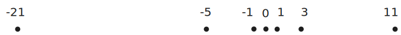

# Introduction to Algorithms

---

## What is an algorithm

Algorithms are the *ideas* behind computer programs.

An algorithm for a program *stays the same* regardless of the programming language used, or the device its running on.

To be interesting, an algorithm has to solve a *general, well-specified* problem.

An algorithmic problem is specified by describing the *complete set of input instances it must work on*, and what desired properties the output must have.

---

## Example problem - sorting

**Input:** A sequence of $N$ numbers $a_{1} \dots a_{n}$

**Output:** the permutation (reordering) of the input sequence such as $a_{1} \leq a_{2} \leq a_{3} \dots \leq a_{n}$.

An instance of sorting might be an array of names, like `['Mike', 'Bob', 'Sally', 'Jill', 'Jan']`, or a list of numbers like `[154, 245, 568, 324, 654, 324]`.

--

### (Contd.)

There are many different algorithms that can solve the problem of sorting.

We seek algorithms which are _correct_ and _efficient_.

A faster algorithm running on a slower computer will _always_ win for sufficiently large instances, as we shall see.

Usually, problems don’t have to get that large before the faster algorithm wins.

---

## Correctness

For any algorithm, we must prove that it _always_ returns the desired output for all legal instances of the problem.

For sorting, this means even if (1) the input is already sorted, or (2) it contains repeated elements.

Algorithm correctness is not obvious in many optimization problems!

Algorithms _problems_ must be carefully specified to allow a provably correct algorithm to exist.  Say we want to visit a bunch of places. We can find the “shortest tour” but not the “best tour”.

---

## Expressing algorithms

We need some way to express the sequence of steps comprising an algorithm.

In order of increasing precision, we have English, pseudocode, and real programming languages. Unfortunately, ease of expression moves in the reverse order.

We start by describing the _ideas_ of an algorithm in English, moving to pseudocode to clarify sufficiently tricky details of the algorithm.

---

## Robot tour optimization

Suppose you have a *robot arm* equipped with a tool, say a soldering iron. 

To enable the robot arm to do a soldering job, we must construct *an ordering of the contact points*, so the robot visits (and solders) the points in order.

We seek the *order which minimizes the time (i.e. travel distance)* it takes to assemble the circuit board.

---

## Robot tour optimization


You are given the job to program the robot arm. Give me an algorithm to find the most efficient tour, starting from point *A*.

---

## Nearest neighbor tour

Lets start at some point *A* and then walk to its nearest neighbor *B* first, then repeat from *B*, etc. until we visit all points.


---

## Nearest neighbor tour is wrong




---

## Closest pair tour

Another idea is to repeatedly connect the closest pair of points whose connection will not cause a cycle or a three-way branch, until all points are in one tour.


---

## Closest pair tour is wrong


---

## Exhaustive search


We could try all possible orderings of the points, then select the one which minimizes the total length.

---

## Exhaustive search is correct

Since all possible orderings are considered, we are guaranteed to end up with the shortest possible tour.

Because it tries all _n_! permutations, it is much too slow to use when there are more than 10-20 points.

No   efficient,   correct   algorithm   exists   for   the   _traveling salesman problem_, as we will see later.

---

## Job Scheduling


A movie star wants to the select the maximum number of starring roles such that no two jobs require their presence at the same time.


---

## Job Scheduling


**Input:** A set _I_ of _n_ intervals on the line.

**Output:**     What   is   the   largest   subset   of   mutually   non-overlapping intervals which can be selected from _I_?

Give an algorithm to solve the problem!

---

## Earliest Job First

Start working as soon as there is work available: 

Accept the earliest starting job _j_ from _I_ which does not overlap any previously accepted job, and repeat until no more such jobs remain.


---

## Earliest Job First is wrong

The first job might be so long that it prevents us from taking any other job.


---

## Shortest Job First


Always take the shortest possible job, so you spend the least time working (and thus unavailable).

Once a job is selected, remove all other jobs that intersect with it.


---

## Shortest Job First is wrong


Taking the shortest job can prevent us from taking two longer jobs which barely overlap it.


---

## Earliest Job to Finish First


Accept job _j_ with the earliest completion date.

Delete _j_, and whatever intersects _j_ from _I_.


---

## Earliest Job to Finish First is correct

**Proof:** Other jobs may well have started before the first to complete (say, _x_), but all must at least partially overlap both _x_ and each other.

Thus we can select at most one from the group.

The first these jobs to complete is _x_, so selecting any job but _x_ would only block out more opportunities after _x_.


---

## Demonstrating incorrectness


Searching for counterexamples is the best way to disprove the correctness of a heuristic.

- Think about all small examples.
- Think about examples with ties on your decision criteria (e.g. pick the nearest point).
- Think about examples with extremes of big and small ...


---

## Demonstrating correctness

Failure to find a counterexample to a given algorithm does not mean “it is obvious” that the algorithm is correct.

*Mathematical induction* is a very useful method for proving the correctness of recursive algorithms.

Another common way to prove correctness is *by contradiction*.

---

## Induction

Recursion and induction are the same basic idea: 
1. *basis case* - prove that the algorithm is correct for some basis case like an input of size $n = 1$.
2. *general assumption* - assume that the algorithm is correct all the way for $n = m - 1$
3. *general case* - prove that if its true for $n = m - 1$, then it is also true for $n = m$

---

## Example - Sum of exponents

Prove that the following formula is correct:
$$
\sum_{i = 0}^{n} a^{i} = \frac{a^{n+1} - 1}{a - 1}
$$

+ Base case: $n = 0 \implies a^{0} = 1 = \frac{a^{0+1} - 1}{a-1}$ which is true.
+ Inductive hypothesis: Assume that the formula holds for all $n$ up to $m$.
+ Inductive step: $\sum_{i = 0}^{m+1} a^{i}$
+ ${} = \sum_{i = 0}^{m} a^{i} + a^{m+1} {}$
+ ${} =\frac{a^{m+1} - 1}{a - 1} + a^{m+1} {}$
+ = $\frac{a^{m+2} - 1}{a - 1}$
+ Conclusion: If the formula holds true for $n = m$, it also holds true for $n = m+1$. Therefore, it holds true for all $n$.


---

## Proof by contradiction

The basic scheme of a contradiction argument is as follows:
- Assume that the hypothesis (the statement you want to prove) is false. 
- Develop some logical consequences of this assumption. 
- Show that one consequence is demonstrably false, thereby showing that the assumption is incorrect and the hypothesis is true.

---

## Example - Number of primes

Prove that there are infinitely many prime numbers.

+ Assume that statement above is incorrect. That is there are only a finite number of primes $m$.
+ List the primes $\{ p_{1}, p_{2}, \dots, p_{m} \}$
+ Suppose we construct the integer formed as the product of “all” of the listed primes: $N = \prod^m_{i=1} p_{i}$
+ This integer N has the property that it is divisible by each and every one of the known primes, because of how it was built.
+ Lets consider the integer $N+1$. It is not divisible by any of the primes $\{ p_{1}, p_{2}, \dots, p_{m} \}$ because $N$ is. Thus $N+1$ is a prime itself - *contradiction*.
+ Therefore our assumption must be false.


---

## Example - Euclid's GCD algorithm

```python
# a recursive algorithm to compute GCDs
# input : Non-negative integers a, b such that b ≤ a 
# output: gcd(a, b)
def euclid(a, b):
	if b == 0: return a
	else return euclid(b, a % b)
```

---

## Euclid's GCD algorithm - Proof of correctness

+ We will prove that $gcd(a,b)=gcd(b,r)$ where $r = a \bmod b$
+ Let $a = qb + r$ where $q$ and $b$ are integers and ${} 0 \leq r < b$.
+ If some integer $p$ divides both $a$ and $b$, then it must also divide $r = a - qb$
+ Thus, the set of all integers that divide $a$ and $b$, and the set of all integers that divide $b$ and $r$ are the same.
+ Choose the largest number form this set. This is the GCD.
+ Therefore $gcd(a, b) = gcd(b, r)$


---

## Homework Problems

The knapsack problem is as follows: given a set of integers $S = \{ s_{1}, s_{2}, \dots, s_{n} \}$ and a target number T, find a subset of S that adds up exactly to T. 

For example, there exists a subset within $S$ = {1, 2, 5, 9, 10} that adds up to $T$ = 22 but not $T$ = 23.

Find counterexamples to each of the following algorithms for the knapsack problem. That is, give an S and T where the algorithm does not find a solution that leaves the knapsack completely full, even though a full-knapsack solution exists.

(a) Put the elements of S in the knapsack in left to right order if they fit, that is, the first-fit algorithm.

(b) Put the elements of S in the knapsack from smallest to largest, that is, the best-fit algorithm.

(c) Put the elements of S in the knapsack from largest to smallest.