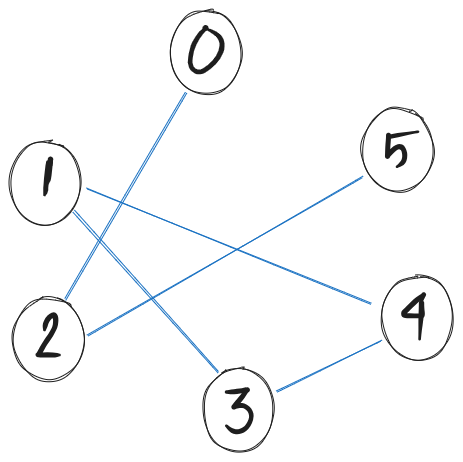
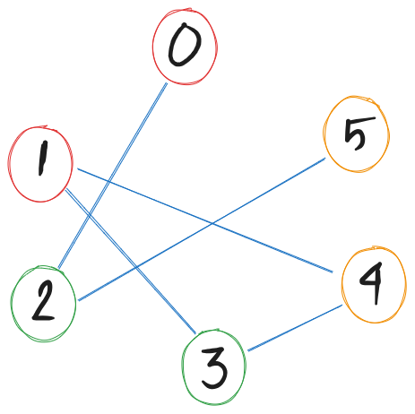

# Part 1 — The Big Picture

## Maze

```txt
 _ _ _ _ _ _ _ _ _ _ _ _ _ _ _ _
|S   #       #                  |
|#   #   #   #   # # # # # # #  |
|        #       #              |
|  # # # # # # # #   # # # # # #|
|                    #          |
|# # # #   # # # # # #   # # #  |
|                        #      |
|  # # # # # # # # # # # #   # #|
|  #                            |
|  #   # # # # # # # # # # # #  |
|  #   #                     #  |
|  #   #   # # # # # # # #   #  |
|      #   #             #   #  |
|# # # #   #   # # # #   #   #  |
|          #         #       #  |
|  # # # # # # # #   # # # # # E|
_ _ _ _ _ _ _ _ _ _ _ _ _ _ _ _
```

## What Is Combinatorial Search?

Many problems ask: **"Find a solution among a huge set of candidates."**

:::: {.columns}
::: {.column width="55%"}
**Examples:**

- Arrange 8 queens on a chessboard so none attack each other
- Find a path through a maze
- Schedule meetings with no conflicts
- Solve a Sudoku puzzle
- Colour a map with 4 colours
:::
::: {.column width="45%"}
**The naive plan:**

```
for every possible candidate:
    if it is a valid solution:
        return it
```

**Problem:** the candidate space is *astronomically* large.
:::
::::

---

## Why Brute Force Fails

For **n-Queens** (placing n non-attacking queens):

| n | Arrangements to check |
|---|----------------------|
| 8 | 4,426,165,368 |
| 10 | ~3.6 billion |
| 15 | ~1.3 trillion |
| 20 | ~6 × 10¹⁷ |

> Even at 10⁹ checks/second, n=20 would take **~20 years**.

We need a smarter strategy.

---

## The Core Insight: Build Incrementally

Instead of generating *complete* candidates, **build solutions step by step**.

At every step:

1. **Extend** the partial solution by one choice
2. **Check** immediately — is this partial solution still valid?
3. If **not valid** → abandon it entirely (***backtrack***!)
4. If **valid** → keep going

This is **backtracking**: systematic exploration with early abandonment.

---

# Part 2 — Backtracking

## The Backtracking Template

```{.python code-line-numbers=""}
def explore(partial_solution):
    if is_complete(partial_solution):
        record(partial_solution)          # found a solution!
        return

    for choice in get_choices(partial_solution):
        if is_valid(partial_solution, choice):
            partial_solution.add(choice)    # make the choice
            explore(partial_solution)       # explore further
            partial_solution.remove(choice) # undo (backtrack)
```

> The "undo" step is what makes backtracking work.
> We explore, retreat, and try something else.

---

## Example 1: The Maze

**Problem:** Find a path from Start (S) to End (E) in a grid.

```
S . . #
# # . #
. . . .
# # # E
```

**Choices at each step:** move Up, Down, Left, or Right  
**Constraint:** stay in bounds, don't hit `#`, don't revisit cells

**Backtrack when:** we hit a dead end with no valid moves

---

## Maze — Step-by-Step Trace

```
S . . #
# # . #
. . . .
# # # E
```

```
Start: [(0,0)]

→ Try Right: (0,1) ✓  →  Path: [(0,0),(0,1)]
  → Try Right: (0,2) ✓  →  Path: [(0,0),(0,1),(0,2)]
    → Try Right: (0,3) = '#'  ✗
    → Try Down: (1,2) ✓  →  Path: [...,(1,2)]
      → Try Down: (2,2) ✓  →  Path: [...,(2,2)]
        → Try Right: (2,3) ✓  →  Path: [...,(2,3)]
          → Try Down: (3,3) = 'E' ✓  DONE!
```

Simple idea, powerful result. The key is the **undo** on dead ends.

---

## Python Maze

```python
maze = \
[['S', ' ', 'X', ' ', ' ', ' ', 'X', ' ', ' ', ' ', ' ', ' ', ' ', ' ', ' ', ' '],
 ['X', ' ', 'X', ' ', 'X', ' ', 'X', ' ', 'X', 'X', 'X', 'X', 'X', 'X', 'X', ' '],
 [' ', ' ', ' ', ' ', 'X', ' ', ' ', ' ', 'X', ' ', ' ', ' ', ' ', ' ', ' ', ' '],
 [' ', 'X', 'X', 'X', 'X', 'X', 'X', 'X', 'X', ' ', 'X', 'X', 'X', 'X', 'X', 'X'],
 [' ', ' ', ' ', ' ', ' ', ' ', ' ', ' ', ' ', ' ', 'X', ' ', ' ', ' ', ' ', ' '],
 ['X', 'X', 'X', 'X', ' ', 'X', 'X', 'X', 'X', 'X', 'X', ' ', 'X', 'X', 'X', ' '],
 [' ', ' ', ' ', ' ', ' ', ' ', ' ', ' ', ' ', ' ', ' ', ' ', 'X', ' ', ' ', ' '],
 [' ', 'X', 'X', 'X', 'X', 'X', 'X', 'X', 'X', 'X', 'X', 'X', 'X', ' ', 'X', 'X'],
 [' ', 'X', ' ', ' ', ' ', ' ', ' ', ' ', ' ', ' ', ' ', ' ', ' ', ' ', ' ', ' '],
 [' ', 'X', ' ', 'X', 'X', 'X', 'X', 'X', 'X', 'X', 'X', 'X', 'X', 'X', 'X', ' '],
 [' ', 'X', ' ', 'X', ' ', ' ', ' ', ' ', ' ', ' ', ' ', ' ', ' ', ' ', 'X', ' '],
 [' ', 'X', ' ', 'X', ' ', 'X', 'X', 'X', 'X', 'X', 'X', 'X', 'X', ' ', 'X', ' '],
 [' ', ' ', ' ', 'X', ' ', 'X', ' ', ' ', ' ', ' ', ' ', ' ', 'X', ' ', 'X', ' '],
 ['X', 'X', 'X', 'X', ' ', 'X', ' ', 'X', 'X', 'X', 'X', ' ', 'X', ' ', 'X', ' '],
 [' ', ' ', ' ', ' ', ' ', 'X', ' ', ' ', ' ', ' ', 'X', ' ', ' ', ' ', 'X', ' '],
 [' ', 'X', 'X', 'X', 'X', 'X', 'X', 'X', 'X', ' ', 'X', 'X', 'X', 'X', 'X', 'E']]
```

---

##  Maze — Python Code

```{.python code-line-numbers="|2-4|6|8-10|12-15|17-19|"}
def solve(r, c, path):
  if not (0 <= r < 16 and 0 <= c < 16) 
    or maze[r][c] == 'X' or (r, c) in path:
   return False

  path.append((r, c))

  # Base Case: Found the Exit
  if maze[r][c] == 'E':
   return True

  # Explore: Up, Down, Left, Right
  for dr, dc in [(0, 1), (1, 0), (0, -1), (-1, 0)]:
   if solve(r + dr, c + dc, path):
    return True

  # Backtrack
  path.pop()
  return False

solution_path = []
rc = solve(0, 0, solution_path)
if rc: print("Path to exit:", solution_path)
else: print("No path found.")
```

---

## Example 2: Subsets That Sum to a Target

**Problem:** Given `[3, 1, 4, 2, 5]`, find **all** subsets that sum to **6**.

**Approach:** At each position, decide **include** or **skip** the element.

::: {.fragment}
```{.txt}
backtrack(index=0, current_sum=0, chosen=[])
├── include 3  → sum=3
│   ├── include 1  → sum=4
│   │   ├── include 4  → sum=8  ✗ (over target)
│   │   ├── skip    4
│   │   │   ├── include 2  → sum=6  ✓ [3,1,2]
│   │   │   └── skip 2
│   │   │       └── include 5 → sum=9 ✗
│   │   └── ...
│   └── skip 1
│       ├── include 4  → sum=7  ✗
│       └── skip 4
│           ├── include 2  → sum=5
│           │   └── include 5 → sum=10 ✗
│           └── skip 2
│               └── include 5 → sum=8 ✗
└── skip 3  → ...  (finds [1,5])
```
:::

---

## Subset Sum — Code

```{.python code-line-numbers="|5-9|11-14|16-17|"}
def subset_sum(nums, target):
    results = []

    def explore(index, current_sum, chosen):
        if current_sum == target:
            results.append(chosen[:])  # found a valid subset!
            return
        if index == len(nums) or current_sum > target:
            return                     # dead end

        # Choice 1: include nums[index]
        chosen.append(nums[index])
        explore(index + 1, current_sum + nums[index], chosen)
        chosen.pop()  # ← undo

        # Choice 2: skip nums[index]
        explore(index + 1, current_sum, chosen)
    explore(0, 0, [])
    return results

print(subset_sum([3, 1, 4, 2, 5], 6))
# → [[3, 1, 2], [1, 5], [4, 2]]
```

---

## Example 3: N-Queens

**Problem:** Place n queens on an n×n board so no two queens share a row, column, or diagonal.

**Key observations:**

- Place **one queen per row** (so row index = recursion depth)
- Track which **columns** and **diagonals** are taken

```
Row 0:  Q . . .    Q placed in col 0
Row 1:  . . Q .    col 0 and diagonals blocked → col 2 is free
Row 2:  . . . .    cols 0,2 and diagonals blocked → ...
Row 3:  . Q . .    eventually col 1 works!
```

---

## N-Queens — Code

```python
def n_queens(n):
    solutions = []
    cols = set()
    diag1 = set()   # row - col (top-left to bottom-right)
    diag2 = set()   # row + col (top-right to bottom-left)

    def explore(row, placement):
        if row == n:
            solutions.append(placement[:])
            return

        for col in range(n):
            if col in cols or (row-col) in diag1 or (row+col) in diag2:
                continue   # ← this column/diagonal is attacked

            cols.add(col); diag1.add(row-col); diag2.add(row+col)
            placement.append(col)

            explore(row + 1, placement)   # try next row

            placement.pop()                 # ← backtrack
            cols.remove(col); diag1.remove(row-col); diag2.remove(row+col)

    explore(0, [])
    return solutions
```

---

## N-Queens — How Many Solutions?

| n | Solutions | Nodes explored (brute) | Nodes explored (backtracking) |
|---|-----------|------------------------|-------------------------------|
| 4 | 2 | 256 | ~26 |
| 6 | 4 | 46,656 | ~152 |
| 8 | 92 | 16,777,216 | ~2,057 |
| 10 | 724 | ~10 billion | ~15,720 |

> Backtracking reduces explored nodes by **orders of magnitude**. And we haven't even pruned yet!

---

# Part 3 — Pruning

## What Is Pruning?

**Backtracking** abandons paths that are already *invalid*.

**Pruning** goes further: abandon paths that *cannot possibly* lead to a valid solution — even if the partial solution is still technically valid.


**Backtracking check:**

> "Is what I've done so far *broken*?"

**Pruning check:**

> "Even if I keep going, *can I possibly succeed*?"

Pruning is about **look-ahead**: reasoning about the future before you explore it.

---

## Pruning in Subset Sum

Recall `subset_sum([3, 1, 4, 2, 5], target=6)`.

**Sort the array first:** `[1, 2, 3, 4, 5]`

Now we can prune aggressively:

```python
def explore(index, current_sum, chosen):
    if current_sum == target:
        results.append(chosen[:])
        return

    for i in range(index, len(nums)):
        # PRUNING: if even the smallest remaining element
        # pushes us over the target, stop immediately
        if current_sum + nums[i] > target:
            break   # ← all subsequent are even larger (sorted!)

        chosen.append(nums[i])
        explore(i + 1, current_sum + nums[i], chosen)
        chosen.pop()
```

One extra line. **Huge** reduction in explored nodes.

---

## Pruning: The "Promising" Check

A standard pattern is to add a `is_promising()` check before recursing:

```python
def explore(partial_solution):
    if not is_promising(partial_solution):  # ← prune here
        return

    if is_complete(partial_solution):
        record(partial_solution)
        return

    for choice in get_choices(partial_solution):
        partial_solution.add(choice)
        explore(partial_solution)
        partial_solution.remove(choice)
```

`is_promising()` encodes domain knowledge:  
*"Given what I've committed to, is there any way to finish successfully?"*

---

## Example: Sudoku with Constraint Propagation

**Problem:** Fill a 9×9 grid so each row, column, and 3×3 box contains digits 1–9.

```
. 5 . | . . . | . 7 .
. . 8 | . . . | 4 . .
. . . | 9 . 3 | . . .
------+-------+------
...   (81 cells total)
```

**Backtracking alone:** pick an empty cell, try digits 1–9.

**Pruning idea:** before placing a digit, compute the set of *still-possible* values for every empty cell.

After placing one digit, you can immediately *eliminate* many candidates in the same row/column/box.

If any cell's *candidate set becomes empty* → prune immediately, no need to recurse.

---

## Sudoku — Simplified Code

```python
def solve_sudoku(board):
    empty = find_empty(board)
    if not empty:
        return True   # all cells filled → solution!

    row, col = empty

    for digit in range(1, 10):
        if is_valid_placement(board, row, col, digit):
            board[row][col] = digit

            # PRUNING: check if any cell now has 0 options
            if not any_cell_has_no_options(board):
                if solve_sudoku(board):   # recurse
                    return True

            board[row][col] = 0   # ← backtrack

    return False
```

> `any_cell_has_no_options` is the pruning check — it looks ahead without committing.

---

## Pruning Strategies: A Taxonomy {visibility="hidden"}

| Strategy | Idea | Example |
|----------|------|---------|
| **Feasibility pruning** | Current state already violates a constraint | N-Queens column check |
| **Bound pruning** | Can't possibly reach target | Subset sum with sorted array |
| **Forward checking** | Future cells/variables have no valid options | Sudoku candidate elimination |
| **Symmetry breaking** | Many solutions are equivalent; explore only one | N-Queens: only left half of row 0 |
| **Constraint propagation** | Propagate constraints to eliminate future choices | Arc consistency in CSPs |

---

# Part 4 — Graph Colouring

## Graph Colouring: A Classic Application

**Problem:** Colour a graph's vertices with at most k colours so no two adjacent vertices share a colour.

**Application:** map colouring, register allocation, scheduling.

::: {.r-stack}
::: {.fragment}
{width=45%}

With k=3: can we colour nodes 0, 1, 2, 3, 4, 5 so neighbours differ?
:::
::: {.fragment}
{width=45%}

With k=3: can we colour nodes 0, 1, 2, 3, 4, 5 so neighbours differ?
:::
:::

---

## Graph Colouring — Code

```python
def is_safe(v, graph, c):
    for neighbor in graph[v]:
        if colors[neighbor] == c:
            return False
    return True


def solve_graph_coloring(graph, k, v=0):
    # Base Case: All vertices are colored
    if v == len(graph):
        return True

    # Try different colors for vertex v
    for c in range(1, k + 1):
        if is_safe(v, graph, c):
            colors[v] = c  # Choose

            if solve_graph_coloring(graph, k, v + 1):  # Explore
                return True

            colors[v] = 0  # Backtrack (Un-choose)

    return False

graph = [[2], [3, 4], [0, 5], [1, 4], [1, 3], [2]]
colors = [0] * len(graph)
print(solve_graph_coloring(graph, 2), colors)
colors = [0] * len(graph)
print(solve_graph_coloring(graph, 3), colors)
```

---

# Part 5 — Comparing & Analysing

## Visualising the Search Tree

For **n=4 queens**, the search tree looks like this:

```
                      (start)
           col0      col1      col2      col3
           ────      ────      ────      ────
          [Q...]    [.Q..]    [..Q.]    [...Q]
          / | \      ...
    [Q..] [..Q.] [...Q]       ← row 1 placements
      ✗     |      ✗          ← col0,diag conflict
          [..Q.]
          / | \
       ✗    |    ✗
          [...Q]
            |
          [.Q..]  ✓  →  solution: [1, 3, 0, 2]
```

Pruned branches are shown as ✗ — we never recurse into them.

---

## Complexity Analysis

Backtracking doesn't change the **worst case** (still exponential), but it dramatically improves **average case**.

| Algorithm | Worst Case | Typical Case |
|-----------|-----------|--------------|
| Brute force | O(n!) or O(kⁿ) | Same |
| Backtracking | O(n!) or O(kⁿ) | Much better |
| Backtracking + pruning | O(n!) or O(kⁿ) | Far better |

> The key metric is **nodes explored**, not theoretical complexity class.
> Good pruning can reduce explored nodes from billions to thousands.

---

## Key Design Decisions

When implementing backtracking + pruning, ask yourself:

1. **What is a "partial solution"?**  
   → What state do I need to track?

2. **What are the choices at each step?**  
   → What's the branching factor?

3. **What makes a partial solution invalid?** (backtracking)  
   → Implement this check cheaply

4. **What makes a partial solution *hopeless*?** (pruning)  
   → This is where domain knowledge pays off

5. **Can I order choices to fail fast?**  
   → Try the most constrained variables first (MRV heuristic)

---

# Part 6 — Summary & Practice

## What We Covered Today

:::: {.columns}
::: {.column width="50%"}
**Backtracking**

- Build solutions incrementally
- Abandon invalid partial solutions immediately
- Template: choose → recurse → undo
- Examples: Maze, Subset Sum, N-Queens, Sudoku, Graph Colouring
:::
::: {.column width="50%"}
**Pruning**

- Look ahead before recursing
- Abandon *hopeless* (not just invalid) branches
- Strategies: feasibility, bounds, forward checking, symmetry
- Can reduce explored nodes by orders of magnitude
:::
::::

> **Rule of thumb:** backtracking is the engine, pruning is the fuel.

---

## Practice Problems

Try these in order of difficulty:

1. **Permutations** — generate all permutations of `[1,2,3]`
2. **Phone keypad** — given `"23"`, list all letter combinations (`2→abc, 3→def`)
3. **Combination sum** — find all subsets of `[2,3,6,7]` summing to `7` (elements reusable)
4. **Word search** — find if word `"ABCCED"` exists in a letter grid
5. **Sudoku solver** — solve an arbitrary 9×9 board
6. **N-Queens count** — how many solutions for n=12? (add symmetry-breaking pruning)

---

## LeetCode Connections

| Problem | Technique |
|---------|-----------|
| LC 46 — Permutations | Backtracking |
| LC 78 — Subsets | Backtracking |
| LC 39 — Combination Sum | Backtracking + bound pruning |
| LC 79 — Word Search | Backtracking on grid |
| LC 51 — N-Queens | Backtracking + feasibility pruning |
| LC 37 — Sudoku Solver | Backtracking + forward checking |
| LC 698 — Partition to K Equal Subsets | Backtracking + symmetry pruning |

---

## One-Slide Cheat Sheet

```python
def backtrack(state):
    # 1. Prune: is there any hope?
    if not is_promising(state):
        return

    # 2. Base case: is state a complete solution?
    if is_complete(state):
        record(state)
        return

    # 3. Recurse: try every valid next choice
    for choice in get_choices(state):
        make(state, choice)       # commit
        backtrack(state)          # explore
        undo(state, choice)       # retreat ← the heart of backtracking
```

> Memorise this template. Every problem in this class follows it.

---

## Summary

:::: {.columns}
::: {.column width="60%"}
**Key takeaways:**

- Backtracking = depth-first search + undo
- Pruning = domain-aware early termination
- The combination turns intractable problems practical
- Same template applies across all examples
:::
::: {.column width="40%"}
**Next class:**

- Branch and Bound (optimisation variant)
- Memoisation & Dynamic Programming
- When backtracking meets memoisation
:::
::::

> *"The art of backtracking is knowing when to give up."*
