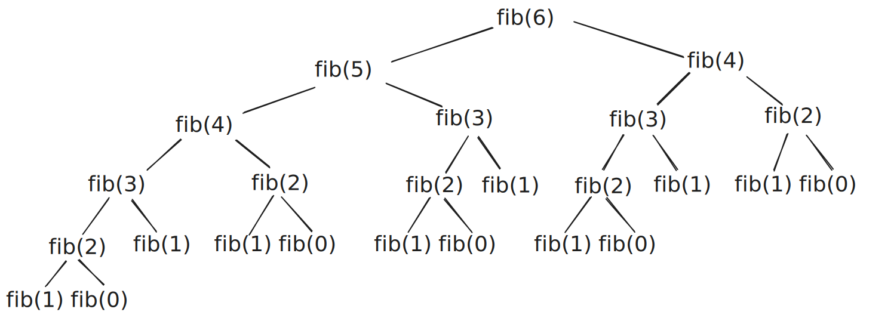
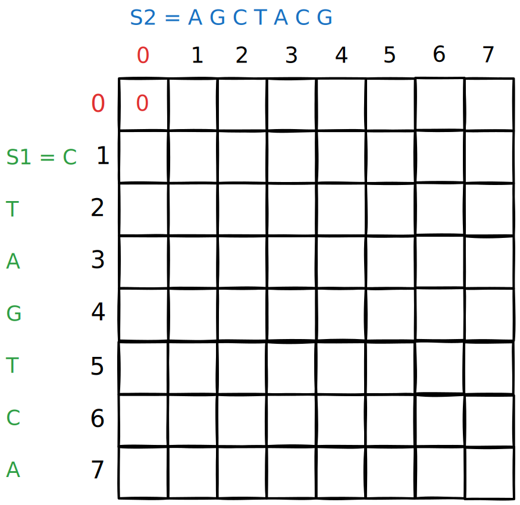
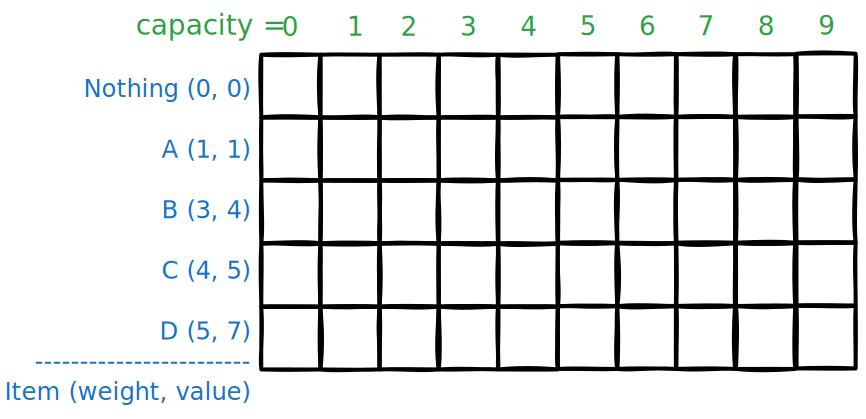

# Part 1 — The Big Idea  {background-color="#0d1b2a"}

## What Is Dynamic Programming?

**Dynamic Programming (DP)** is a technique for solving problems by:

1. Breaking them into **overlapping subproblems**
2. Solving each subproblem **once**
3. **Storing** the result so it's never recomputed

:::: {.columns}
::: {.column width="50%"}
::: {.fragment}
**DP is NOT:**

- A data structure
- A specific algorithm
- Only for hard problems
:::
:::
::: {.column width="50%"}

::: {.fragment}
**DP IS:**

- A *way of thinking* about recursion
- An optimisation of repeated work
- Recursion + memory
:::
:::
::::

. . . 

> **One-liner:** *"Remember what you've already solved."*

---

## The Two Ingredients of DP

Every DP problem requires exactly two things:

:::: {.columns}
::: {.column width="50%"}
::: {.fragment}
**1. Optimal Substructure**

The optimal solution to the problem *contains* optimal solutions to its subproblems.

> "I can build the best answer from the best answers to smaller versions."
:::
:::
::: {.column width="50%"}
::: {.fragment}
**2. Overlapping Subproblems**

The same subproblems appear *again and again* during recursion.

> "I keep solving the same smaller problems repeatedly — let me cache them."
:::
:::
::::

. . .

If both conditions hold → **DP will help you**.

---

## DP vs. Divide & Conquer

| | Divide & Conquer | Dynamic Programming |
|---|---|---|
| Subproblems | **Independent** | **Overlapping** |
| Reuse results? | No (not needed) | Yes (essential) |
| Examples | Merge Sort, Binary Search | Fibonacci, Knapsack |
| Overhead | Recursion only | Recursion + memory |

. . . 

> Merge Sort splits [1..n] into [1..n/2] and [n/2+1..n]. Those halves never overlap.
> 
> Fibonacci needs fib(4) to compute both fib(5) and fib(6). They *do* overlap.


# Part 2 — Fibonacci: The "Hello World" of DP {background-color="#0d1b2a"}

## Fibonacci — Naive Recursion

$$F(n) = F(n-1) + F(n-2), \quad F(0)=0,\ F(1)=1$$

```python
def fib(n):
    if n <= 1:
        return n
    return fib(n-1) + fib(n-2)
```

Simple and correct. But let's trace `fib(6)`:

. . . 

{width="50%"}

<!-- ```
fib(5)
├── fib(4)
│   ├── fib(3)
│   │   ├── fib(2)  ← computed here
│   │   └── fib(1)
│   └── fib(2)      ← computed AGAIN
└── fib(3)          ← computed AGAIN
    ├── fib(2)      ← computed AGAIN (3rd time!)
    └── fib(1)
``` -->

. . . 

**Time complexity: O(2ⁿ)**  — doubles with every step. Terrible!

---

## Why Is It So Slow?

The call tree for `fib(6)` has **25 nodes**, even though there are only **7 distinct subproblems** (fib(0)…fib(6)).

{width="50%"}

`fib(3)` alone is called **3 times**, `fib(2)` is called **5 times**.

> This is the **overlapping subproblems** problem.  
> The fix? Store results the first time. **Memoisation.**

---

## Fibonacci — Top-Down DP (Memoisation)

Add a cache. If we've seen it before, return the stored answer.

```python
memo = {}
def fib_memo(n):
    if n in memo:
        return memo[n]          # ← cache hit!
    if n <= 1:
        return n

    memo[n] = fib_memo(n-1) + fib_memo(n-2)  # ← store result in cache
    return memo[n]
```

Now `fib(5)` only ever computes each value **once**:

```
fib(5) → fib(4) → fib(3) → fib(2) → fib(1) = 1
                                   → fib(0) = 0
                         → fib(1) = 1  [cached: skip]
               → fib(2) = 1  [cached: skip]
         → fib(3) = 2  [cached: skip]
```

**Time: O(n) — Space: O(n)**

---

## Fibonacci — Bottom-Up DP (Tabulation)

Instead of recursing top-down, fill a table from the base cases upward.

```python
def fib_dp(n):
    if n <= 1:
        return n

    dp = [0] * (n + 1)
    dp[0] = 0
    dp[1] = 1

    for i in range(2, n + 1):
        dp[i] = dp[i-1] + dp[i-2]   # ← use already-computed values

    return dp[n]
```

| i | 0 | 1 | 2 | 3 | 4 | 5 | 6 | 7 |
|---|---|---|---|---|---|---|---|---|
| dp[i] | 0 | 1 | 1 | 2 | 3 | 5 | 8 | 13 |

**Time: O(n) — Space: O(n)** *(can reduce to O(1) with two variables)*

---

## Two Flavours of DP

| | Top-Down (Memoisation) | Bottom-Up (Tabulation) |
|---|---|---|
| **Style** | Recursive + cache | Iterative + table |
| **Order** | Lazy (computed on demand) | Explicit (fill in order) |
| **Easier to** | Write (mirrors recurrence) | Optimise (no call stack) |
| **Risk** | Stack overflow for large n | Need to figure out fill order |
| **Use when** | Not all subproblems needed | All subproblems needed |

> Both give the same asymptotic complexity.  
> Start with top-down (it's easier), then convert to bottom-up if needed.


# Part 3 — Climbing Stairs  {background-color="#0d1b2a"}

## Problem: Climbing Stairs

> You're climbing a staircase with **n** steps.  
> Each move you can climb **1 or 2** steps.  
> How many distinct ways can you reach the top?

. . . 

**Examples:**

- n = 1: `[1]` → **1 way**
- n = 2: `[1+1]`, `[2]` → **2 ways**
- n = 3: `[1+1+1]`, `[1+2]`, `[2+1]` → **3 ways**
- n = 4: `[1+1+1+1]`, `[1+1+2]`, `[1+2+1]`, `[2+1+1]`, `[2+2]` → **5 ways**

Notice anything? 

. . . 

`1, 2, 3, 5, 8, 13, ...` — it's Fibonacci!

---

## Climbing Stairs — Recurrence

**Key insight:** to reach step `n`, you came from either:

- step `n-1` (took a 1-step), or
- step `n-2` (took a 2-step)

So: `ways(n) = ways(n-1) + ways(n-2)`

. . .

```python
def climb_stairs(n):
    if n <= 2:
        return n

    dp = [0] * (n + 1)
    dp[1] = 1   # one way to reach step 1
    dp[2] = 2   # two ways to reach step 2

    for i in range(3, n + 1):
        dp[i] = dp[i-1] + dp[i-2]

    return dp[n]
```

. . . 

**This problem teaches the core DP pattern:**  define `dp[i]` = answer for subproblem of size `i`, build up from base cases.


# Part 4 — Coin Change {background-color="#0d1b2a"}

## Problem: Coin Change

> You have coins of denominations `[1, 5, 6, 9]`.  
> What is the **minimum number of coins** to make amount `n = 11`?

Greedy fails here! Greedy picks 9 first → `9 + 1 + 1 = 3 coins`.  
But optimal is `5 + 6 = 2 coins`. ✓

**Why DP?** To make amount `n`, we can use any coin `c`, and then we need to make `n - c` with minimum coins. The subproblems overlap heavily.

---

## Coin Change — Recurrence

Let `dp[i]` = minimum coins needed to make amount `i`.

**Recurrence:**
$$dp[i] = 1 + \min_{c \in \text{coins}} dp[i - c] \quad \text{for } i \geq c$$

**Base case:** `dp[0] = 0` (zero coins needed to make 0)

**Intuition:** for each amount, try every coin and take the best option.

---

## Coin Change — Building the Table

Coins = `[1, 5, 6, 9]`, target = 11

| Amount | 0 | 1 | 2 | 3 | 4 | 5 | 6 | 7 | 8 | 9 | 10 | 11 |
|--------|---|---|---|---|---|---|---|---|---|---|----|----|
| dp     | 0 | 1 | 2 | 3 | 4 | 1 | 1 | 2 | 2 | 1 | 2  | **2** |

For `dp[11]`:

- Use coin 1: `dp[10] + 1 = 3`
- Use coin 5: `dp[6] + 1 = 2` ✓
- Use coin 6: `dp[5] + 1 = 2` ✓
- Use coin 9: `dp[2] + 1 = 3`

Answer: **2 coins** (e.g. 5 + 6)

---

## Coin Change — Code

```python
def coin_change(coins, amount):
    INF = float('inf')
    dp = [INF] * (amount + 1)
    dp[0] = 0   # base case

    for i in range(1, amount + 1):
        for coin in coins:
            if coin <= i and dp[i - coin] != INF:
                dp[i] = min(dp[i], dp[i - coin] + 1)

    return dp[amount] if dp[amount] != INF else -1

print(coin_change([1, 5, 6, 9], 11))  # → 2
print(coin_change([2], 3))            # → -1 (impossible)
```

**Time: O(amount × |coins|)**  
**Space: O(amount)**


# Part 5 — Longest Common Subsequence  {background-color="#0d1b2a"}

## Problem: Longest Common Subsequence (LCS)

> Given two strings, find the length of their **longest common subsequence**.

A *subsequence* keeps characters in order but skips some.

**Example:**
```
s1 = "ABCBDAB"
s2 = "BDCABA"

LCS = "BCBA"  (length 4)
```

`B_C_B_A` appears in both strings (in order, not necessarily contiguous).

**Applications:** diff tools (git diff!), DNA sequence alignment, spell checking.

---

## LCS — Recurrence

Define `dp[i][j]` = LCS length of `s1[0..i-1]` and `s2[0..j-1]`.

**Recurrence:**

$dp[i][j] = \begin{cases} dp[i-1][j-1] + 1 & \text{if } s1[i-1] = s2[j-1] \\ \max(dp[i-1][j],\ dp[i][j-1]) & \text{otherwise} \end{cases}$

**Intuition:**

- Characters match → extend the LCS by 1
- Characters don't match → take the better of skipping from either string

**Base cases:** `dp[0][j] = 0`, `dp[i][0] = 0` (empty string has no common subsequence)

---

## LCS — Filling the Table

$dp[i][j] = \begin{cases} dp[i-1][j-1] + 1 & \text{if } s1[i-1] = s2[j-1] \\ \max(dp[i-1][j],\ dp[i][j-1]) & \text{otherwise} \end{cases}$

::: {.columns}
::: {.column width="35%"}

Sequence 1: `C T A G T C A`
Sequence 2: `A G C T A C G`

- Each cell only looks at its left, top, and diagonal neighbour.
- `dp[0][j] = 0`, `dp[i][0] = 0`

:::
::: {.column width="65%"}
{width="70%"}
:::
:::
<!-- end columns -->


---

## LCS — Code

```python
def lcs(s1, s2):
    m, n = len(s1), len(s2)
    dp = [[0] * (n + 1) for _ in range(m + 1)]

    for i in range(1, m + 1):
        for j in range(1, n + 1):
            if s1[i-1] == s2[j-1]:
                dp[i][j] = dp[i-1][j-1] + 1      # characters match!
            else:
                dp[i][j] = max(dp[i-1][j], dp[i][j-1])  # take the best

    return dp[m][n]

print(lcs("ABCBDAB", "BDCABA"))  # → 4
print(lcs("AGGTAB",  "GXTXAYB")) # → 4
```

**Time: O(m × n)**  
**Space: O(m × n)** *(reducible to O(min(m,n)) with a rolling array)*


# Part 6 — 0/1 Knapsack {background-color="#0d1b2a"}

## Problem: 0/1 Knapsack

> You have a knapsack with **capacity W**.  
> There are `n` items, each with a **weight** and a **value**.  
> Maximise total value without exceeding capacity.  
> Each item is either taken (1) or left (0).

**Example:** capacity W = 7

| Item | Weight | Value |
|------|--------|-------|
| A | 1 | 1 |
| B | 3 | 4 |
| C | 4 | 5 |
| D | 5 | 7 |

Best choice: **B + C** = weight 7, value **9** ✓

---

## Knapsack — Recurrence

Define `dp[i][w]` = max value using the first `i` items with capacity `w`.

**For each item `i`, two choices:**

$$
dp[i][w] = \begin{cases} dp[i-1][w] & \text{skip item } i \\ dp[i-1][w - wt_i] + val_i & \text{take item } i \quad (\text{if } wt_i \leq w) \end{cases}
$$

Take the **maximum** of the two options.

**Base case:** `dp[0][w] = 0` for all w (no items → no value)

---

## Knapsack — Filling the Table

$$
dp[i][w] = \begin{cases} dp[i-1][w] & \text{skip item } i \\ dp[i-1][w - wt_i] + val_i & \text{take item } i \quad (\text{if } wt_i \leq w) \end{cases}
$$

::: {.columns}
::: {.column width="35%"}
| Item | Weight | Value |
|------|--------|-------|
| A | 1 | 1 |
| B | 3 | 4 |
| C | 4 | 5 |
| D | 5 | 7 |

Capacity = 7
:::
::: {.column width="65%"}
{width="100%"}
:::
:::
<!-- end columns -->


<!-- |   | w=0 | 1 | 2 | 3 | 4 | 5 | 6 | 7 |
|---|-----|---|---|---|---|---|---|---|
| (none) | 0 | 0 | 0 | 0 | 0 | 0 | 0 | 0 |
| A(1,1) | 0 | 1 | 1 | 1 | 1 | 1 | 1 | 1 |
| B(3,4) | 0 | 1 | 1 | 4 | 5 | 5 | 5 | 5 |
| C(4,5) | 0 | 1 | 1 | 4 | 5 | 6 | 6 | 9 |
| D(5,7) | 0 | 1 | 1 | 4 | 5 | 7 | 8 | 9 | -->

---

## Knapsack — Code

```python
def knapsack(weights, values, W):
    n = len(weights)
    dp = [[0] * (W + 1) for _ in range(n + 1)]

    for i in range(1, n + 1):
        wt, val = weights[i-1], values[i-1]
        for w in range(W + 1):
            # Option 1: skip item i
            dp[i][w] = dp[i-1][w]

            # Option 2: take item i (if it fits)
            if wt <= w:
                dp[i][w] = max(dp[i][w], dp[i-1][w - wt] + val)

    return dp[n][W]

weights = [1, 3, 4, 5]
values  = [1, 4, 5, 7]
print(knapsack(weights, values, 7))   # → 9
```

**Time: O(n × W) — Space: O(n × W)**


# Part 7 — Summary and Key Takeaways {background-color="#0d1b2a"}

## The DP Design Process

When you see a new problem, ask these questions **in order**:

::: {.incremental}

1. Can I define the problem recursively?

   → "What smaller versions of this problem do I need?"

2. Do subproblems overlap?

   → Draw the recursion tree. Are the same calls repeated?

3. What is my `dp[...]` state?

   → What information fully describes a subproblem?

4. What is the recurrence?

   → How does `dp[i]` (or `dp[i][j]`) depend on smaller states?

5. What are the base cases?

   → What are the smallest subproblems I can answer directly?

6. In what order should I fill the table?

   → Each cell must be computed after the cells it depends on.

:::

---

## Identifying the State

The **state** is the hardest part. It must capture *everything* you need to solve a subproblem — no more, no less.

| Problem | State | Meaning |
|---------|-------|---------|
| Fibonacci | `dp[i]` | `F(i)` |
| Climbing Stairs | `dp[i]` | ways to reach step `i` |
| Coin Change | `dp[i]` | min coins for amount `i` |
| LCS | `dp[i][j]` | LCS of `s1[0..i-1]` and `s2[0..j-1]` |
| Knapsack | `dp[i][w]` | max value using first `i` items, capacity `w` |

> **Rule of thumb:** if the problem has one "variable dimension" → 1D table.  
> If it has two → 2D table. Three → 3D. (Rare beyond 3D.)

---

## Common DP Patterns

| Pattern | Signature | Examples |
|---------|-----------|---------|
| **Linear** | `dp[i]` depends on `dp[i-1]`, `dp[i-2]` | Fibonacci, Stairs, Max Subarray |
| **Prefix** | `dp[i]` = best answer for first `i` elements | Coin Change, Jump Game |
| **Interval** | `dp[i][j]` = answer for subarray `[i..j]` | Matrix Chain, Burst Balloons |
| **Two-sequence** | `dp[i][j]` = answer for `s1[0..i]`, `s2[0..j]` | LCS, Edit Distance |
| **Knapsack** | `dp[i][w]` = best using `i` items, budget `w` | 0/1 Knapsack, Subset Sum |

Recognising the pattern is half the battle.

---

## Space Optimisation: Rolling Arrays {visibility="hidden"}

Many DP tables only look at the **previous row** (or 1-2 previous values). You can often reduce O(n²) space to O(n) or even O(1).

**Fibonacci: O(n) → O(1)**
```python
# Instead of storing all dp[0..n]
a, b = 0, 1
for _ in range(n - 1):
    a, b = b, a + b
return b
```

**LCS / Knapsack: O(m×n) → O(n)**
```python
# Keep only the previous row
prev = [0] * (n + 1)
for i in range(1, m + 1):
    curr = [0] * (n + 1)
    for j in range(1, n + 1):
        # ... fill curr[j] using prev[j] and prev[j-1]
    prev = curr
```

## All Four Examples Side by Side

| Problem | Dimensions | Recurrence idea | Complexity |
|---------|-----------|-----------------|------------|
| **Fibonacci** | 1D | `dp[i] = dp[i-1] + dp[i-2]` | O(n) time |
| **Coin Change** | 1D | `dp[i] = 1 + min(dp[i-c])` | O(n·k) time |
| **LCS** | 2D | match → extend; mismatch → max of skip | O(mn) time |
| **Knapsack** | 2D | skip or take each item | O(nW) time |

---

## The DP Cheat Sheet {visibility="hidden"}

```
┌─────────────────────────────────────────────────────────┐
│  DYNAMIC PROGRAMMING IN 4 STEPS                         │
│                                                         │
│  1. STATE     dp[i] or dp[i][j] = subproblem answer     │
│  2. BASE      fill in the smallest/simplest cases       │
│  3. RECUR     express dp[i] in terms of smaller dp      │
│  4. ORDER     fill table so dependencies come first     │
│                                                         │
│  Optimise later: rolling arrays, space reduction        │
└─────────────────────────────────────────────────────────┘
```

---

## Practice Problems {visibility="hidden"}

In order of difficulty:

1. **House Robber** — max sum with no two adjacent elements (LC 198)
2. **Min Cost Climbing Stairs** — stair problem with costs (LC 746)
3. **Longest Increasing Subsequence** — LIS in an array (LC 300)
4. **Edit Distance** — min insertions/deletions/replacements to transform s1→s2 (LC 72)
5. **Partition Equal Subset Sum** — can array be split into two equal-sum halves? (LC 416)
6. **Unique Paths** — count paths in m×n grid moving only right/down (LC 62)

---

## LeetCode Map {visibility="hidden"}

| Problem | Pattern | Difficulty |
|---------|---------|------------|
| LC 70 — Climbing Stairs | Linear | Easy |
| LC 198 — House Robber | Linear | Easy |
| LC 322 — Coin Change | Prefix / Knapsack | Medium |
| LC 300 — Longest Increasing Subsequence | Linear | Medium |
| LC 1143 — LCS | Two-sequence | Medium |
| LC 72 — Edit Distance | Two-sequence | Medium |
| LC 416 — Partition Equal Subset | Knapsack | Medium |
| LC 312 — Burst Balloons | Interval | Hard |

---

## Backtracking vs DP — When to Use Which?

*(Connecting to last class!)*

| | Backtracking | Dynamic Programming |
|---|---|---|
| **Goal** | Find *a* solution / all solutions | Find the *optimal* solution |
| **Subproblems** | Independent (tree structure) | Overlapping |
| **Saves work via** | Pruning | Memoisation |
| **Output** | Solution(s) | Value / count |
| **Complexity** | Exponential (but pruned) | Polynomial |

> **In practice:** if you find yourself doing backtracking and the subproblems repeat → add memoisation → you've discovered DP!

---

## Key Takeaways

:::: {.columns}
::: {.column width="55%"}
**What DP gives you:**

- Polynomial solutions to seemingly exponential problems
- A systematic, repeatable design process
- The ability to prove optimality via the recurrence

**What you need to practice:**

- Identifying overlapping subproblems
- Defining the right state
- Writing the recurrence *before* the code
:::
::: {.column width="45%"}
**Next class:**

- More example of Dynamic Programming
- Limitations of DP
- *Next Tuesday: Quiz on Dynamic Programming*
:::
::::

> *"DP is just recursion that remembers its past."*
