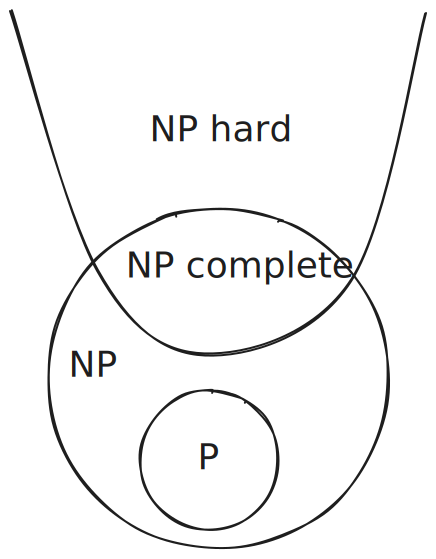

# Part 1: The Big Question {background-color="#1a1a2e"}

## What Does It Mean for a Problem to Be "Hard"?

Some problems feel genuinely different from others.

. . .

**Easy to solve:**

- Sort a list of numbers
- Find the shortest path in a map
- Check if a number is even

. . .

**Seemingly harder:**

- Find the shortest *tour* visiting every city and returning home
- Schedule classes so no student has two at once
- Pack items into a suitcase to maximize value

. . .

> Is this just a matter of not being clever enough yet — or is something deeper going on?

---

## The Two Tasks: Solving vs. Checking

Here's a key observation.

. . .

**For many hard problems**, even if we can't *find* a solution quickly...

. . .

...we *can* **verify** a proposed solution quickly.

. . .

::: {.callout-note}
## Example: Sudoku
- **Hard:** Fill in a blank 9×9 Sudoku grid correctly.  
- **Easy:** Check whether a completed grid is valid.
:::

. . .

This gap between *finding* and *checking* is at the heart of P vs. NP.

---

## A Tale of Two Students

> Alice is given a Sudoku puzzle and must fill it in from scratch.  
> Bob is handed a completed grid and must check if it's right.

. . .

- Bob's job is clearly easier.
- Is Alice's job *fundamentally* harder? Or just harder in practice?

. . .

**This is the P vs. NP question** — one of the biggest unsolved problems in all of mathematics.

---

# Part 2: Defining the Players {background-color="#16213e"}

## What Is a "Decision Problem"?

Before defining P and NP, we need a common format for problems.

. . .

A **decision problem** has a yes/no answer:

| Problem | Decision version |
|---|---|
| Find shortest path | Is there a path of length ≤ k? |
| Find a schedule | Is there a valid schedule? |
| Factor a number | Does n have a factor < k? |

. . .

We focus on decision problems because they're clean to reason about — and most optimization problems have a natural decision version.

---

## The Class P

**P** = the set of decision problems solvable in **polynomial time**.

. . .

Polynomial time means the algorithm runs in $O(n^k)$ steps for some fixed $k$, where $n$ is the input size.

. . .

::: {.columns}
::: {.column width="50%"}
**In P:**

- Is this list sorted?
- Is there a path from A to B?
- Is this number prime?
- Does this graph have an Euler circuit?
:::
::: {.column width="50%"}
**What "polynomial" buys us:**

- $O(n)$ — linear, great
- $O(n^2)$ — quadratic, fine
- $O(b^{10})$ — $b$ is the number of bits. technically polynomial, but rough
:::
:::

. . .

**Intuition:** P is the class of problems we can *solve* efficiently.

---

## The Class NP

**NP** = the set of decision problems where a "yes" answer can be **verified** in polynomial time.

. . .

More carefully: given a proposed solution (called a **certificate** or **witness**), we can check it quickly.

. . .

::: {.callout-note}
## Examples
- **Hamiltonian Cycle:** Given a graph and a proposed cycle, check it visits every vertex exactly once. ✓ Easy to check!
- **3-Colorability:** Given a graph and a proposed coloring, verify no two adjacent vertices share a color. ✓ Easy to check!
- **Subset Sum:** Given numbers and a proposed subset, check if they sum to the target. ✓ Easy to check!
:::

. . .

**NP does NOT mean "not polynomial"** — it stands for **Nondeterministic Polynomial time**.

---

## P vs. NP — The Picture

```
         All Problems
    ┌───────────────────────────────┐
    │                               │
    │    ┌───────────────────┐      │
    │    │        NP         │      │
    │    │   ┌───────────┐   │      │
    │    │   │     P     │   │      │
    │    │   │           │   │      │
    │    │   └───────────┘   │      │
    │    │                   │      │
    │    └───────────────────┘      │
    │                               │
    └───────────────────────────────┘
```

. . .

- Every problem in P is also in NP. (If you can solve it fast, you can certainly verify it fast.)
- The question: **Is P = NP?** Is there anything in NP that's *not* in P?

. . .

Most researchers believe **P ≠ NP** — but nobody has proved it.

---

## Why Does P ≠ NP Feel True?

Think about creativity vs. appreciation:

. . .

- It's much easier to *appreciate* a great novel than to *write* one.
- It's much easier to *verify* a proof than to *discover* one.
- It's much easier to *check* a schedule is valid than to *build* one.

. . .

If P = NP, then **finding** would be no harder than **checking** — which feels profoundly wrong.

. . .

> "If P = NP, then the world would be a profoundly different place...  
> There would be no special value in 'creative leaps,' no fundamental gap between solving a problem and recognizing the solution...
> 
> Everyone who could appreciate a symphony would be Mozart; everyone who could follow a step-by-step argument would be Gauss; everyone who could recognize a good investment strategy would be Warren Buffett."  
> — [Scott Aaronson](https://scottaaronson.blog/?p=122)

---

# Part 3: NP-Completeness {background-color="#0f3460"}

## The Hardest Problems in NP

Some problems in NP seem especially hard. We call them **NP-complete**.

. . .

**Definition:** A problem $X$ is NP-Complete if:

1. $X \in$ **NP** — a proposed solution can be *verified* in polynomial time
2. Every problem in NP is **polynomial-time reducible** to $X$

. . .

Informally: if you could solve *any* NP-complete problem efficiently, you could solve *all* of NP efficiently — and P would equal NP.

. . .

::: {.callout-important}
## The Stakes
If anyone finds a polynomial-time algorithm for even one NP-complete problem, then **P = NP** and cryptography, as we know it, collapses.
:::

---

## Famous NP-Complete Problems

::: {.columns}
::: {.column width="50%"}
**Graph Problems**

- Hamiltonian Cycle
- Graph Coloring (3+ colors)
- Clique
- Independent Set
- Vertex Cover
:::
::: {.column width="50%"}
**Other Problems**

- 3-SAT (Boolean satisfiability) - *first proven NP-Complete (Cook, 1971)*
- Subset Sum
- Bin Packing
- Traveling Salesman (decision version)
- Scheduling with constraints
:::
:::

. . .

These all look completely different — but they're all secretly the *same* problem in disguise.

. . .

That's where **reductions** come in.

---

## NP-Hard

**Definition:** A problem $X$ is NP-Hard if:

- Every problem in NP is **polynomial-time reducible** to $X$
- But $X$ itself need **not** be in NP

. . .

**Classic examples:**

- Halting Problem *(undecidable — not even in NP)*
- Travelling Salesman Problem (optimization version)
- Chess on an $n \times n$ board
- Protein folding (general case)
- Minimum circuit size problem

. . .

::: {.callout-warning}
NP-Hard problems may be *harder* than NP-Complete — some are undecidable entirely.
:::

---

## The Core Difference

```{=html}
<table style="width:100%; font-size: 0.9em; border-collapse: collapse;">
  <thead>
    <tr style="background:#eeedfe;">
      <th style="padding:8px; border:1px solid #afa9ec;">Property</th>
      <th style="padding:8px; border:1px solid #afa9ec; color:#3c3489;">NP-Complete</th>
      <th style="padding:8px; border:1px solid #d0a090; color:#993c1d;">NP-Hard</th>
    </tr>
  </thead>
  <tbody>
    <tr>
      <td style="padding:8px; border:1px solid #ccc;">Must be a decision problem</td>
      <td style="padding:8px; border:1px solid #ccc; text-align:center;">✅ Yes</td>
      <td style="padding:8px; border:1px solid #ccc; text-align:center;">❌ No</td>
    </tr>
    <tr style="background:#fafafa;">
      <td style="padding:8px; border:1px solid #ccc;">Solution verifiable in poly-time</td>
      <td style="padding:8px; border:1px solid #ccc; text-align:center;">✅ Yes</td>
      <td style="padding:8px; border:1px solid #ccc; text-align:center;">❌ Not required</td>
    </tr>
    <tr>
      <td style="padding:8px; border:1px solid #ccc;">NP-Hard (every NP reduces to it)</td>
      <td style="padding:8px; border:1px solid #ccc; text-align:center;">✅ Yes</td>
      <td style="padding:8px; border:1px solid #ccc; text-align:center;">✅ Yes</td>
    </tr>
    <tr style="background:#fafafa;">
      <td style="padding:8px; border:1px solid #ccc;">Can be undecidable</td>
      <td style="padding:8px; border:1px solid #ccc; text-align:center;">❌ No</td>
      <td style="padding:8px; border:1px solid #ccc; text-align:center;">✅ Yes</td>
    </tr>
    <tr>
      <td style="padding:8px; border:1px solid #ccc;">Subset relationship</td>
      <td style="padding:8px; border:1px solid #ccc; text-align:center;">NPC ⊆ NP-Hard</td>
      <td style="padding:8px; border:1px solid #ccc; text-align:center;">NP-Hard ⊇ NPC</td>
    </tr>
  </tbody>
</table>
```

---

## The Complexity Landscape



This diagram assumes P ≠ NP, which is the widely believed but unproven conjecture. If P = NP, then the entire NP circle would collapse into P.

<!-- ::: {.callout-note appearance="minimal"}
**P ⊆ NP-Complete ⊆ NP ⊆ NP-Hard** — each class nests within the next.
::: -->


# Part 4: Reductions {background-color="#533483"}

## What Is a Reduction?

A **reduction** from problem A to problem B means:

> "If I can solve B, I can solve A."

. . .

We transform any instance of A into an instance of B, solve B, and translate the answer back.

. . .

```
   Input to A ──> [Transform] ──> Input to B ──> [Solve B] ──> Answer to B
                                                                     │
                                                                     v
   Answer to A <───────────────────────────────────────────────────[Translate]
```

. . .

**Key requirement:** The transformation must run in polynomial time.

---

## Reduction Intuition: The Adapter {visibility="hidden"}

Think of a reduction like a power adapter:

. . .

- You have a US plug (Problem A) and a European outlet (Problem B solver).
- The adapter transforms the plug so it fits the outlet.
- The adapter doesn't solve your problem — the outlet does.
- The adapter just needs to be simple and reliable.

. . .

If you have the adapter (reduction), and access to the outlet (B solver), you can always charge your phone (solve A).

---

## Reduction: The Logic

If A reduces to B (written $A \leq_p B$), then:

. . .

- **B is at least as hard as A.**  
  (If B were easy, A would be too.)

. . .

- **Contrapositively:** If A is hard, then B must be hard too.

. . .

::: {.callout-tip}
## Proving NP-completeness
To show a new problem X is NP-complete:  
1. Show X is in NP (easy if you can verify solutions quickly)  
2. Take a known NP-complete problem (like 3-SAT) and reduce it to X.  
This shows X is at least as hard as 3-SAT, so X is NP-complete.
:::

---

## A Concrete Example: Independent Set → Vertex Cover

**Independent Set:** Does graph G have k vertices with no edges between them?

**Vertex Cover:** Does graph G have k vertices that *touch* every edge?

. . .

**Claim:** These two problems are equivalent via a simple reduction.

. . .

::: {.callout-note}
## The Key Observation
A set S is an independent set ↔ V \ S (all other vertices) is a vertex cover.
:::

. . .

**Why?** Every edge must have at least one endpoint in V \ S — because if both endpoints were in S, they'd violate the independent set condition.

---

## Independent Set ↔ Vertex Cover: Example

Consider this graph (6 vertices):

```
    1 ─── 2
    │     │
    3 ─── 4 ─── 5
              │
              6
```

. . .

- **Independent Set** of size 3: {1, 4, 6}? Check: no edges between them... yes! ✓
- **Vertex Cover** of size 3: {2, 3, 5}? Check: does every edge have an endpoint here?  
  - 1-2 ✓, 2-4 ✓, 1-3 ✓, 3-4 ✓, 4-5 ✓, 5-6 ✓ — yes! ✓

. . .

The independent set and vertex cover are **complements** of each other.

---

## The Reduction (Formally)

**Reducing Independent Set to Vertex Cover:**

Given: Instance (G, k) of Independent Set  
Produce: Instance (G, n−k) of Vertex Cover  

. . .

- Same graph G
- Target size changes from k to n−k
- **Answer is the same!**

. . .

This transformation takes $O(1)$ time — it's trivially polynomial.  
So Independent Set $\leq_p$ Vertex Cover, and vice versa.

---

## 3-SAT: The Universal Problem

**3-SAT:** Given a Boolean formula in CNF with exactly 3 literals per clause, is there an assignment of variables that makes it true?

. . .

Example:
$$(x_1 \lor \lnot x_2 \lor x_3) \land (\lnot x_1 \lor x_2 \lor x_4) \land (x_2 \lor \lnot x_3 \lor \lnot x_4)$$

. . .

3-SAT was the *first* problem proved NP-complete (Cook, 1971). Almost every NP-hardness proof starts here.

. . .

> The game: reduce 3-SAT → your problem. Show that solving your problem would let us solve 3-SAT.


